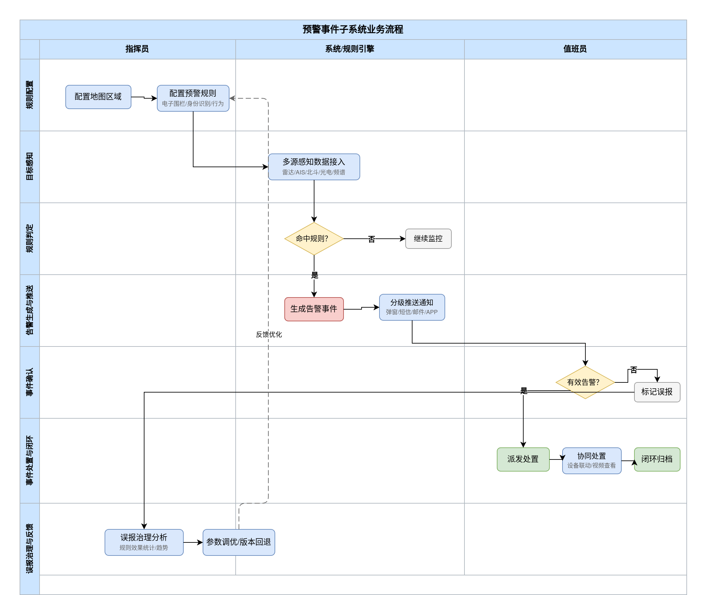
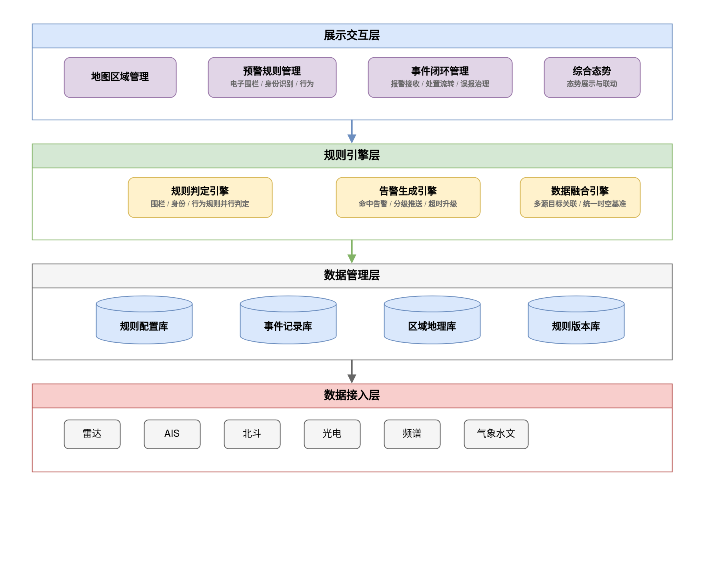
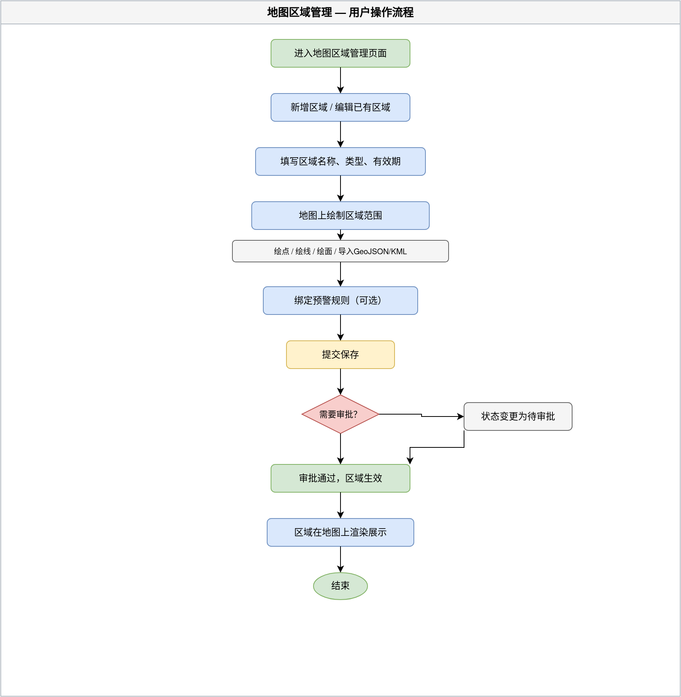
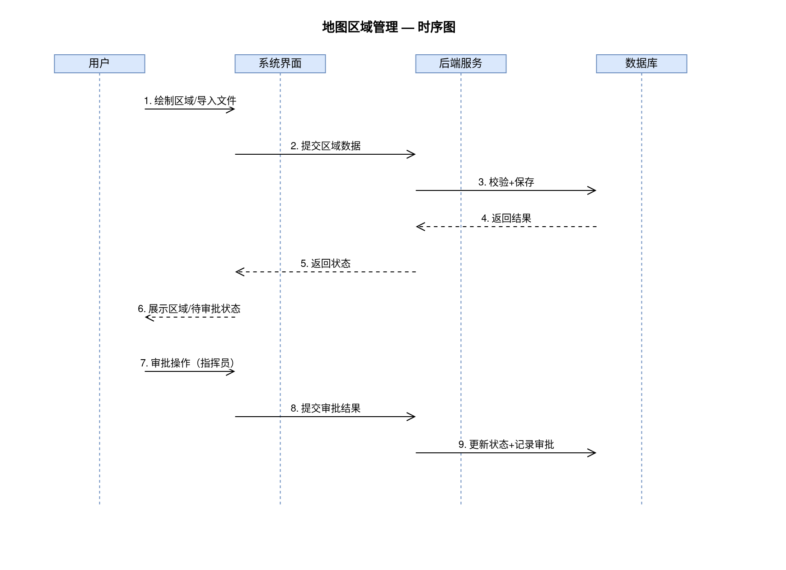
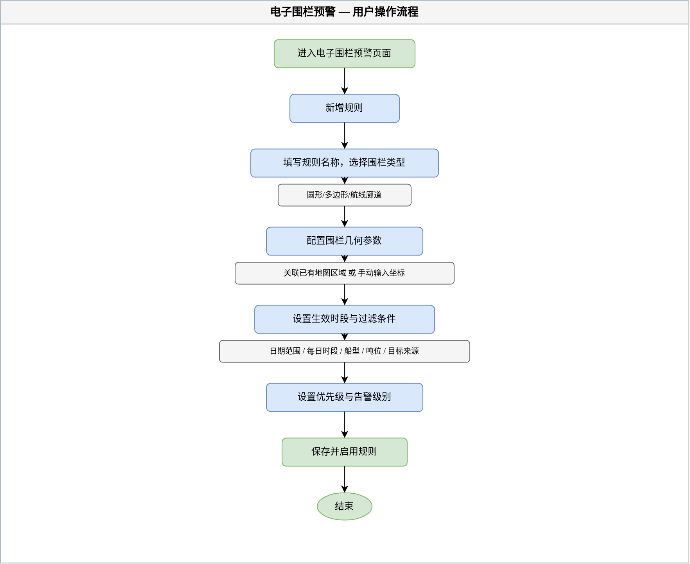
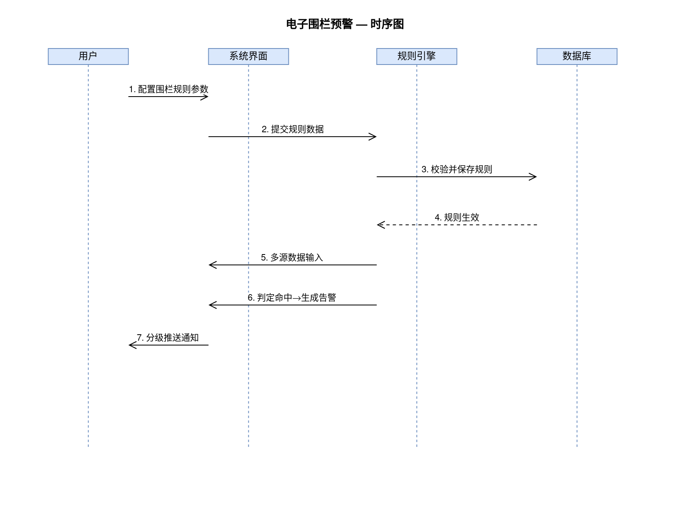
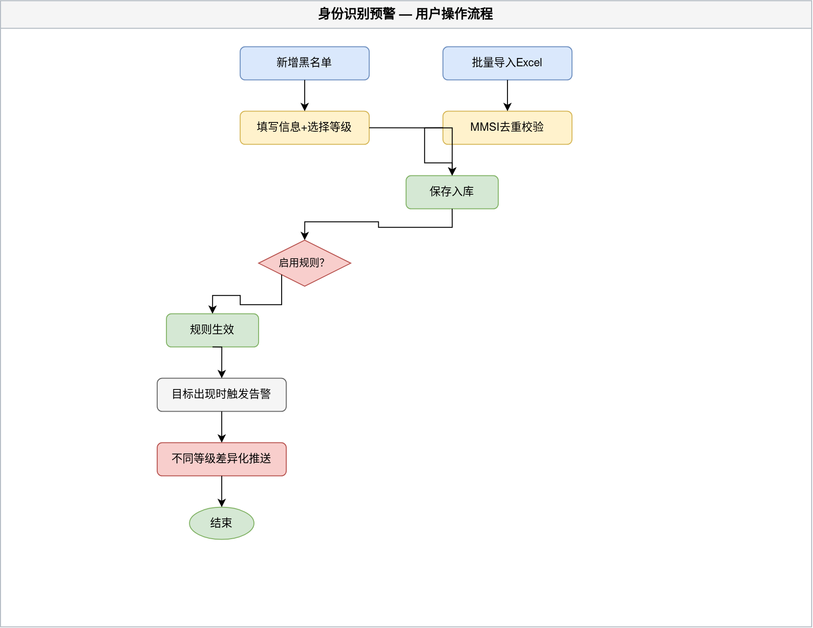
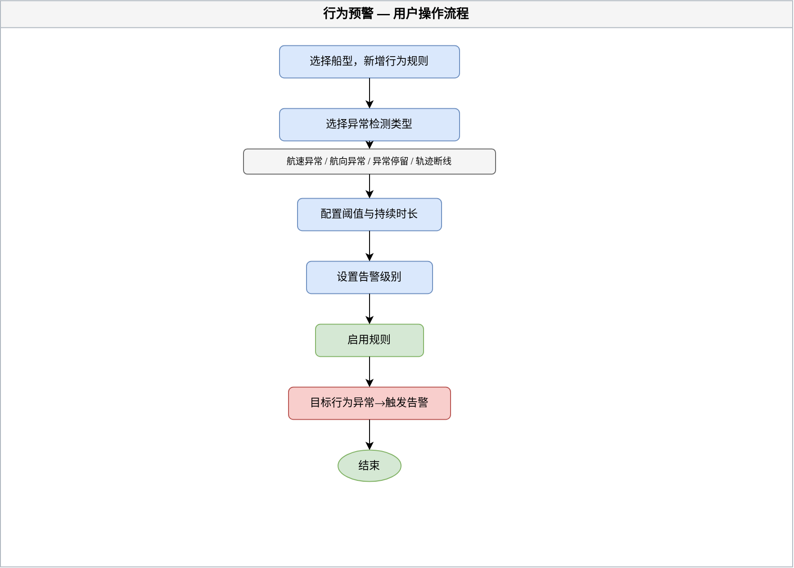
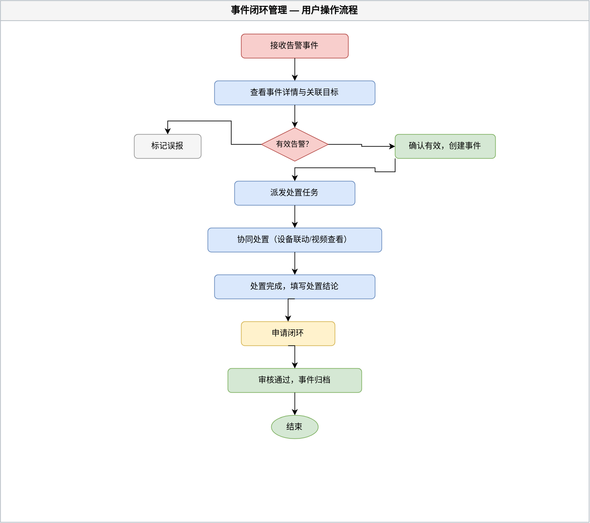

# 一、文档信息

| 项目名称 | 综合态势与多源感知系统 |
|---------|---------------------|
| 文档版本 | V1.1 |
| 编制日期 | 2026-07-29 |
| 编制人 | - |
| 审核人 | - |
| 批准人 | - |
| 客户单位 | - |
| 编制单位 | - |
| 适用范围 | 预警事件子系统——包含地图区域管理、预警规则管理（电子围栏/身份识别/行为）、事件闭环管理 |
| 核心目标 | 建立多维度预警规则体系，实现从规则判定、告警生成、事件处置到误报治理的全生命周期闭环管理 |
| 文档状态 | 评审稿 |

**历史版本**

| 版本 | 日期 | 作者 | 更改说明 |
|-----|------|------|---------|
| V1.1 | 2026-07-29 | Codex | 修复5个操作流程图渲染（API兼容性），更新PNG引用 |
| V1.0 | 2026-07-29 | - | 初始版本 |

# 二、项目概述

## 2.1 项目背景

随着海上活动日益频繁，海洋安全管控面临以下挑战：

1. **信息孤岛严重**：雷达、AIS、北斗、光电视频、频谱侦测、气象水文等多源感知数据各自独立运行，缺乏统一时空基准下的融合处理能力，值班人员需要同时盯多个屏幕，信息切换成本高、遗漏风险大。

2. **预警依赖人工**：发现异常目标、判定威胁等级、触发告警等环节高度依赖人工经验，值班人员长时间盯屏容易疲劳，漏报和延迟告警时有发生。

3. **规则配置僵硬**：电子围栏、身份识别、行为异常等预警规则缺乏灵活的时间维度、目标维度和优先级组合配置能力，无法适应复杂的海上管控场景。

4. **处置过程不可追溯**：告警事件从接收、处置到闭环的流程不清晰，派发对象不明确，超时缺乏自动升级机制，事后难以审计复盘。

5. **误报率高且难治理**：规则参数缺少持续的误报反馈和优化迭代，同一规则反复产生误报却无法有效收敛，值班人员对告警产生"狼来了"心理。

为解决上述问题，建设预警事件子系统，实现从被动监看向主动预警的转变，通过多维度预警规则自动判定、全生命周期事件闭环管理和误报持续治理，将综合态势与多源感知系统从"看"的系统升级为"管"的系统。

## 2.2 项目建设目标

本项目旨在建设预警事件子系统，实现以下目标：

1. **建立灵活可配的预警规则体系**：覆盖电子围栏预警（多边形围栏绘制）、身份识别预警（黑名单三级分级）、行为预警（航速/航向/停留/断线）三类规则场景，支持按日期范围、每日时段、星期重复、船型、吨位、目标来源等多维度灵活组合过滤条件。

2. **实现图数结合的区域管理**：基于地图交互绘制工具，支持点、线、面及边界文件导入等多种区域创建方式，区域与预警规则双向绑定，区域变更支持审批留痕。

3. **建立全生命周期事件闭环**：从告警生成、分级推送、确认有效 / 标记误报、派发处置、闭环归档到误报治理反馈的完整流转链路，每步操作有记录、有时限、可溯源。

4. **构建可持续的误报治理机制**：误报标记分类、规则效果趋势统计、参数快照对比和版本管理，支持规则优化迭代和任意版本回退。

5. **实现多角色协同处置**：值班员接收处置、指挥员派发归档、设备操作员联动响应，超时自动升级，确保每条告警有明确的责任人和处理时限。

## 2.3 项目建设范围

本项目建设范围包括：

**系统端**：
- PC端管理后台（Web应用）

**功能模块**：
- 地图区域管理：区域绘制、属性配置、绑定规则、变更审批
- 预警规则管理——电子围栏预警：多边形围栏绘制、时间维度过滤、目标维度过滤、优先级与告警级别
- 预警规则管理——身份识别预警：黑名单管理、批量导入、三级分级、命中追踪
- 预警规则管理——行为预警：航速/航向/停留/断线异常检测规则、误报抑制
- 事件闭环管理：报警接收展示、报警处置流程、误报治理

**数据范围**：
- 地图区域数据（名称、类型、几何信息、有效期、负责人）
- 预警规则数据（围栏参数、黑名单、行为阈值）
- 告警事件数据（触发记录、处置流程、操作时间线）
- 规则版本数据（参数快照、变更记录）

**不包含的功能**：
- 移动端H5/App（后续迭代实现）
- 规则引擎实时计算服务（本子系统聚焦规则配置与事件处置，实时判定由后端规则引擎承担）
- 视频联动播放功能（提供联动视频入口，视频播放能力由设备联动子系统提供）

## 2.4 业务流程图

## 2.5 业务角色定义

| 角色名称 | 角色描述 | 主要职责 | 权限范围 |
|---------|---------|---------|---------|
| 值班员 | 日常值班监控人员 | 接收告警通知、确认告警有效性、处置告警事件、标记误报 | 事件闭环管理（接收与处置） |
| 指挥员 | 业务决策与管理人员 | 配置预警规则、管理地图区域、派发处置任务、闭环归档、误报治理 | 全部功能模块，含规则修改与版本回退 |
| 设备操作员 | 现场设备操作人员 | 响应联动指令、操作光电/雷达等设备协同处置 | 事件闭环管理（查看与联动操作） |
| 运维管理员 | 系统运维与配置人员 | 用户管理、角色权限配置、系统参数维护 | 系统配置功能（不在本子系统范围内） |

## 2.6 术语表

| 术语 | 说明 |
|-----|------|
| MMSI | 海上移动通信业务标识（Maritime Mobile Service Identity），船舶唯一身份编码 |
| AIS | 船舶自动识别系统（Automatic Identification System） |
| 电子围栏 | 在地图上设定的虚拟边界，目标进入/离开/停留时触发告警 |
| 闭环管理 | 从告警生成到处置完成归档的完整流程，每步有记录可追溯 |

# 三、项目建设内容

## 3.1 总体功能架构

预警事件子系统作为综合态势与多源感知系统的一级菜单模块，包含以下功能结构：

**PC 端（管理后台）**

- 预警事件（一级菜单）
  - 地图区域管理（二级菜单）
  - 预警规则管理（二级菜单）
    - 电子围栏预警（三级菜单）
    - 身份识别预警（三级菜单）
    - 行为预警（三级菜单）
  - 事件闭环管理（二级菜单）

### 系统技术架构

预警事件子系统基于综合态势与多源感知系统的整体技术架构构建，前端采用组件化单页应用，后端由规则引擎驱动实时判定，通过统一数据结构与多源感知数据对接。

> 系统架构图如下：

### 功能模块分层

| 层级 | 模块 | 核心职责 |
|------|------|---------|
| 展示交互层 | 地图区域管理 | 区域绘制、属性配置、规则绑定、变更审批 |
| ^ | 预警规则管理 | 围栏规则/黑名单/行为规则配置与优先级管理 |
| ^ | 事件闭环管理 | 告警接收、处置流转、误报治理 |
| 规则引擎层 | 规则判定引擎 | 多源数据实时匹配、围栏/身份/行为规则并行判定 |
| ^ | 告警生成引擎 | 命中规则后生成告警事件、分级推送 |
| 数据管理层 | 规则配置库 | 围栏参数、黑名单、行为阈值、规则版本 |
| ^ | 事件记录库 | 告警事件、处置时间线、误报记录 |
| ^ | 区域地理库 | 地图区域几何数据、关联绑定关系 |
| 数据接入层 | 多源感知接入 | 雷达/AIS/北斗/光电/频谱数据标准化接入 |

## 3.2 需求功能清单

| 序号 | 业务需求 | 需求概述 | 优先级 |
|-----|---------|---------|-------|
| 1 | 地图区域管理 | 支持在地图上绘制点、线、面及多边形区域，配置区域名称、类型、有效期、负责人等属性，区域可绑定预警规则并支持变更审批留痕 | P0 |
| 2 | 电子围栏预警 | 支持地图交互绘制多边形围栏区域，实时计算面积，可按日期范围、每日时段、星期重复配置围栏生效时段，按船型、吨位、目标来源过滤适用目标，支持优先级排序和四级告警级别 | P0 |
| 3 | 身份识别预警 | 维护黑名单目标库（名称、MMSI、呼号、等级），支持Excel批量导入和MMSI去重校验，按一般/重点/高危三级分级，不同等级触发差异化告警策略 | P0 |
| 4 | 行为异常预警 | 按船型独立配置航速异常、航向异常、异常停留、轨迹断线四类行为规则，支持持续时长滤波抑制瞬时误报，断线自动研判分类 | P1 |
| 5 | 告警事件闭环处置 | 告警接收后支持确认有效或标记误报，有效告警经派发处置后闭环归档，每步操作记录时间线和操作人，支持超时自动升级 | P0 |
| 6 | 误报治理与规则优化 | 统计各规则误报率与趋势，支持标记误报原因分类，调整规则参数后记录前后快照对比，支持任意历史版本回退 | P1 |
| 7 | 区域变更审批 | 编辑地图区域后进入待审批状态，记录修改前后对比内容，审批通过后方可生效，审批记录可追溯 | P2 |
| 8 | 多角色权限控制 | 值班员负责告警接收处置，指挥员全权管理规则和区域，设备操作员协同联动，不同角色仅可见可操作对应功能 | P1 |
| 9 | 多渠道分级推送 | 告警生成后按级别配置推送渠道（弹窗/APP推送/短信/邮件）和推送角色，支持超时未处理自动升级推送范围 | P1 |
| 10 | 规则版本管理 | 每次规则修改生成新版本快照，支持任意两版差异对比和一键回退到历史版本，版本记录不可删除 | P2 |

## 3.3 页面功能清单

| 终端 | 一级菜单 | 二级菜单 | 子功能 | 功能描述 |
|-----|---------|---------|-------|---------|
| PC端 | 预警事件 | 地图区域管理 | 筛选 | 按区域名称、类型、状态筛选区域列表 |
| ^ | ^ | ^ | 新增 | 填写区域名称、类型、有效期等信息并在地图上绘制区域范围 |
| ^ | ^ | ^ | 编辑 | 修改区域属性并提交审批 |
| ^ | ^ | ^ | 删除 | 删除区域，关联规则时需确认解除绑定 |
| ^ | ^ | ^ | 绘制区域 | 在地图上交互绘制点、线、面，支持导入边界文件 |
| ^ | ^ | ^ | 绑定规则 | 为区域关联预警规则并设置触发等级和通知方式 |
| ^ | ^ | ^ | 审批 | 查看编辑变更对比，通过或驳回审批 |
| ^ | ^ | 预警规则管理 | 电子围栏预警 | 地图交互绘制多边形围栏区域，实时计算面积，设置生效时段、适用目标和告警级别 |
| ^ | ^ | ^ | 身份识别预警 | 管理黑名单目标库，支持批量导入、分级管理和命中历史查看 |
| ^ | ^ | ^ | 行为预警 | 配置航速/航向/停留/断线四类异常行为检测规则和阈值 |
| ^ | ^ | 事件闭环管理 | 告警接收 | 查看实时告警列表，按等级筛选，查看告警详情和位置 |
| ^ | ^ | ^ | 确认有效性 | 确认告警为有效事件或标记为误报 |
| ^ | ^ | ^ | 派发处置 | 将有效告警派发至指定人员处理 |
| ^ | ^ | ^ | 闭环归档 | 填写处置说明后闭环告警，归档至历史记录 |
| ^ | ^ | ^ | 联动查看 | 跳转查看关联设备视频或目标历史轨迹 |
| ^ | ^ | ^ | 误报治理 | 查看各规则误报率和趋势，调整参数并对比前后效果 |
| ^ | ^ | ^ | 版本管理 | 查看规则修改历史版本，对比差异，回退到历史版本 |
| ^ | ^ | ^ | 推送配置 | 按告警级别配置推送渠道和推送角色，设置超时阈值 |

## 3.4 页面访问权限

| 功能模块 | 值班员 | 指挥员 | 设备操作员 | 运维管理员 |
|---------|-------|-------|-----------|-----------|
| 地图区域管理——查看 | 查看 | 查看 | - | 查看 |
| 地图区域管理——新增/编辑/删除 | - | 全部权限 | - | - |
| 地图区域管理——审批 | - | 全部权限 | - | - |
| 电子围栏预警——查看 | 查看 | 查看 | - | 查看 |
| 电子围栏预警——配置 | - | 全部权限 | - | - |
| 身份识别预警——查看 | 查看 | 查看 | - | 查看 |
| 身份识别预警——管理 | - | 全部权限 | - | - |
| 行为预警——查看 | 查看 | 查看 | - | 查看 |
| 行为预警——配置 | - | 全部权限 | - | - |
| 事件闭环管理——告警接收 | 查看 | 查看 | 查看 | 查看 |
| 事件闭环管理——确认/处置 | 全部权限 | 全部权限 | - | - |
| 事件闭环管理——派发/归档 | - | 全部权限 | - | - |
| 事件闭环管理——联动设备 | - | - | 全部权限 | - |
| 事件闭环管理——误报治理 | - | 全部权限 | - | - |
| 事件闭环管理——版本回退 | - | 全部权限 | - | - |

## 3.5 功能详细设计

### 3.5.1 地图区域管理

**（一）功能需求概述**

地图区域管理用于在电子地图上创建和维护监控区域，指挥员可绘制点、线、面及导入边界文件，配置区域属性和绑定预警规则。区域修改后进入审批流程，审批通过后方可生效。值班员可在地图上查看所有已生效的区域。

**（二）功能设计**

**查询/筛选功能**

支持以下条件筛选，条件之间为"与"关系，点击搜索按钮触发查询：

| 筛选字段 | 类型 | 说明 |
|---------|------|------|
| 区域名称 | 文本输入 | 支持模糊搜索 |
| 区域类型 | 下拉选择 | 重点区域/禁入区域/巡检区域 |
| 状态 | 下拉选择 | 生效/待审批/已失效 |

**列表功能**

| 列名 | 字段类型 | 说明 |
|-----|---------|------|
| 区域名称 | 文本 | 点击可定位到地图对应区域 |
| 区域类型 | 标签 | 重点区域（橙色）/禁入区域（红色）/巡检区域（蓝色） |
| 有效期 | 文本 | 格式：YYYY-MM-DD 至 YYYY-MM-DD；过期自动变更为已失效 |
| 状态 | 标签 | 生效（绿色）/待审批（黄色）/已失效（灰色） |
| 操作 | 操作按钮 | 编辑、删除（无权限时隐藏） |

分页默认每页10条，支持切换每页数量。
列表为空时显示：暂无区域数据。

**新增功能**

点击"新增"，打开编辑窗口，填写区域信息并在地图上绘制区域范围。

| 字段名称 | 类型 | 长度限制 | 必填 | 默认值 | 说明 |
|---------|------|---------|------|-------|------|
| 区域名称 | 文本输入 | 2-50字 | 是 | - | 系统内全局唯一 |
| 区域类型 | 下拉选择 | - | 是 | 重点区域 | 重点区域/禁入区域/巡检区域 |
| 有效期 | 日期范围 | - | 是 | - | 结束时间必须大于开始时间 |
| 负责人 | 用户选择 | - | 否 | - | 来源于组织管理中已启用的用户 |
| 备注 | 文本域 | 不超过200字 | 否 | - | - |
| 区域范围 | 地图绘制 | - | 是 | - | 支持绘点、绘线、绘面或导入边界文件 |

**地图绘制工具**

| 绘制工具 | 说明 |
|---------|------|
| 绘点 | 在地图上单击添加点位 |
| 绘线 | 在地图上单击添加连续的线段 |
| 绘面 | 在地图上单击添加多边形，至少需要3个顶点 |
| 导入边界文件 | 上传GeoJSON或KML文件，系统自动解析并渲染到地图上 |

已绘制的区域以半透明填充和边框高亮方式展示在地图上，支持拖拽编辑顶点、整体移动区域。

新增的区域保存后直接生效。提交成功：提示"新增成功"。

**编辑功能**

点击"编辑"，自动填入当前区域数据。编辑保存后，区域状态变更为"待审批"，需指挥员审批通过后方可生效。审批期间该区域仍以原配置生效。提交成功：提示"已提交审批"。

编辑窗口除上述字段外，还提供：

| 功能 | 说明 |
|------|------|
| 绑定预警规则 | 勾选已创建的电子围栏规则列表，设置每条规则的触发等级和通知方式 |
| 通知方式 | 多选：弹窗/APP推送/短信/邮件 |

**删除功能**

点击"删除"，弹出确认"确定删除该区域吗？删除后不可恢复。"

若该区域已被电子围栏规则关联，阻止删除，提示"该区域已被 X 条规则关联，删除后关联规则将失效，请先解除绑定"。

删除成功：提示"删除成功"。

**审批功能**

编辑提交后生成审批记录，指挥员可在审批列表中查看：

| 列名 | 字段类型 | 说明 |
|-----|---------|------|
| 区域名称 | 文本 | - |
| 变更内容对比 | 对比展示 | 修改前与修改后的字段差异，变更部分高亮显示 |
| 提交人 | 文本 | - |
| 提交时间 | 日期时间 | - |

指挥员可选择"通过"或"驳回"。通过后区域变更为"生效"状态，驳回后恢复为修改前状态。

**（三）业务逻辑关联**

- 区域类型和状态枚举值关联系统全局配置
- 负责人数据来源于组织管理中已启用的用户
- 绑定的预警规则数据来源于预警规则管理模块，需先在该模块中创建规则
- 区域删除或失效后，关联的电子围栏规则中的区域引用自动解除

**（四）用户操作流程图**

**（五）功能时序图**

### 3.5.2 预警规则管理

预警规则管理是预警事件子系统的核心配置模块，覆盖电子围栏预警、身份识别预警、行为预警三类规则场景。指挥员在此配置各类规则的参数、过滤条件和优先级，规则生效后由后端规则引擎实时匹配多源感知数据，命中时自动生成告警事件并推送通知。

#### 3.5.2.1 电子围栏预警

**（一）功能需求概述**

电子围栏预警用于在电子地图上设置虚拟边界规则，当目标进入、离开或停留在围栏范围内时自动触发告警。支持地图交互绘制多边形围栏区域，实时计算面积，可按时间维度（日期范围、每日时段、星期重复）和目标维度（船型、吨位、来源）灵活配置过滤条件，多规则间支持优先级排序和四级告警级别。

**（二）功能设计**

**查询/筛选功能**

| 筛选字段 | 类型 | 说明 |
|---------|------|------|
| 规则名称 | 文本输入 | 支持模糊搜索 |

| 状态 | 下拉选择 | 全部/启用/禁用 |

**列表功能**

| 列名 | 字段类型 | 说明 |
|-----|---------|------|
| 规则名称 | 文本 | - |
| 围栏面积 | 文本 | 自动计算的多边形面积（km²） |
| 关联区域 | 文本 | 关联的地图区域名称，无关联显示"-" |
| 生效时段 | 文本 | 日期范围 + 每日时间段摘要 |
| 适用目标 | 文本 | 船型/吨位/来源摘要 |
| 优先级 | 数字 | 可拖拽调整行顺序 |
| 告警级别 | 标签 | 提示（蓝色）/一般（黄色）/重要（橙色）/紧急（红色） |
| 状态 | 开关 | 启用/停用，直接点击切换 |
| 操作 | 操作按钮 | 编辑/删除/查看命中历史 |

分页默认每页10条。支持拖拽行调整优先级排序，优先级数值越小越优先匹配。

**新增功能**

点击"新增"，打开编辑窗口，分步配置规则参数。

| 字段名称 | 类型 | 长度限制 | 必填 | 默认值 | 说明 |
|---------|------|---------|------|-------|------|
| 规则名称 | 文本输入 | 2-50字 | 是 | - | - |
| 围栏区域 | 绘制按钮 + 小地图预览 | - | 是 | - | 点击"绘制围栏区域"打开全屏绘制弹窗，已绘制后显示小地图预览和面积 |

围栏区域绘制流程：

- 点击"绘制围栏区域"按钮 → 打开全屏绘制弹窗（盖在编辑弹窗之上）
- 全屏弹窗内：Leaflet 地图 + 工具栏（撤销/清除/实时面积）+ 底部（取消/保存区域）
- 点击地图添加多边形顶点，>=3个顶点后点击起点附近或双击闭合
- 保存区域 → 关闭绘制弹窗，回到编辑弹窗，小地图渲染已绘多边形
- 取消 → 放弃绘制，回到编辑弹窗

| 说明 |
|---------|---------|

| 字段名称 | 类型 | 长度限制 | 必填 | 默认值 | 说明 |
|---------|------|---------|------|-------|------|
| 关联区域 | 下拉选择 | - | 否 | - | 选择已创建的地图区域，与手动绘制二选一 |
| 生效日期范围 | 日期范围 | - | 是 | - | 结束时间必须大于开始时间 |
| 每日时间段 | 时间段列表 | - | 是 | 全天 | 支持添加多条，格式：HH:MM-HH:MM，同一规则内时段不可重叠 |
| 按星期重复 | 多选 | - | 否 | 全选 | 周一至周日，支持全选/工作日/周末快捷按钮 |
| 适用船型 | 多选 | - | 是 | 全部 | 渔船/货船/客船/快艇/橡皮艇/三无船/全部 |
| 吨位范围 | 数字输入 | - | 否 | 不限 | 最小-最大（吨），最大必须大于最小 |
| 目标来源 | 多选 | - | 是 | 全部 | 雷达/AIS/北斗/光电/融合/全部 |
| 优先级 | 数字输入 | 1-999 | 是 | 自动分配 | 数值越小越优先，同区域下不可重复 |
| 告警级别 | 下拉选择 | - | 是 | 一般 | 提示/一般/重要/紧急 |
| 状态 | 开关 | - | 是 | 启用 | 启用/停用 |

提交成功：提示"新增成功"。
新增后规则默认为启用状态。

**编辑功能**

点击"编辑"，自动填入当前规则数据。编辑规则参数后自动生成新版本快照，存储到规则版本库中。提交成功：提示"更新成功"。

**删除功能**

点击"删除"，弹出确认"确定删除该规则吗？"。
删除后该规则已触发的处置中事件不受影响，仅历史统计中标记为"规则已删除"。

**优先级拖拽排序**

列表支持拖拽行调整优先级顺序。拖拽后系统自动重新分配优先级数值。调整完成后提示"优先级已更新"。

**查看命中历史**

点击"查看命中历史"，展示该规则的历史触发记录：

| 列名 | 字段类型 | 说明 |
|-----|---------|------|
| 目标名称 | 文本 | - |
| MMSI | 文本 | - |
| 命中时间 | 日期时间 | - |
| 位置坐标 | 文本 | 经度,纬度 |

**业务规则**

- 同一条规则内的每日时间段不可重叠，提交时如存在重叠时段，阻止提交，提示"时间段存在重叠，请调整"。
- 删除已被规则关联的地图区域时，弹窗提示"该区域已被 X 条规则关联，删除后规则将失效"并需二次确认。
- 停用规则后，该规则已触发的处置中事件不受影响，仅不再触发新告警。
- 多边形至少需要3个顶点，少于3个时保存按钮不可点击，提示"多边形至少需要3个顶点"。
- 导入坐标超出地图范围时自动裁剪到可视范围。

**边界与异常**

- **空数据**：列表无数据时，显示"暂无围栏规则数据"
- **未绘制区域**：新增/编辑时若未绘制围栏区域，表单验证提示"请绘制围栏区域"
- **权限不足**：编辑/删除按钮对无权限角色完全隐藏
- **关联区域被删除**：规则中关联区域字段显示"（已删除）"，规则本身不受影响但不再基于该区域判定
- **拖拽冲突**：同时拖拽多条时，按释放顺序依次处理

**（三）业务逻辑关联**

- 关联区域数据来源于地图区域管理中已生效的区域
- 规则命中后生成告警事件，流转至事件闭环管理模块
- 规则版本快照存储于规则版本库，可通过事件闭环管理中的误报治理查看
- 船型枚举值来源于系统全局配置的数据字典

**（四）用户操作流程图**

**（五）功能时序图**

#### 3.5.2.2 身份识别预警

**（一）功能需求概述**

身份识别预警用于维护黑名单目标库，当多源感知数据中发现与黑名单匹配的目标时自动触发告警。支持单个新增和Excel批量导入，MMSI去重校验，按一般/重点/高危三级分级，不同等级触发差异化告警策略。

**（二）功能设计**

**查询/筛选功能**

| 筛选字段 | 类型 | 说明 |
|---------|------|------|
| 目标名称/MMSI | 文本输入 | 支持模糊搜索 |
| 等级 | 下拉选择 | 全部/一般/重点/高危 |
| 状态 | 下拉选择 | 全部/启用/禁用 |

**列表功能**

| 列名 | 字段类型 | 说明 |
|-----|---------|------|
| 目标名称 | 文本 | - |
| MMSI | 文本 | - |
| 呼号 | 文本 | 无值显示"-" |
| 目标编号 | 文本 | 无值显示"-" |
| 等级 | 标签 | 一般（黄色）/重点（橙色）/高危（红色） |
| 加入原因 | 文本 | 超过一行时截断，悬停显示全文 |
| 命中次数 | 数字 | 点击可查看命中历史 |
| 加入时间 | 日期时间 | - |
| 状态 | 开关 | 启用/禁用，直接点击切换 |
| 操作 | 操作按钮 | 编辑/删除/查看命中历史 |

分页默认每页10条。

**新增功能**

点击"新增"，打开编辑窗口。

| 字段名称 | 类型 | 长度限制 | 必填 | 默认值 | 说明 |
|---------|------|---------|------|-------|------|
| 目标名称 | 文本输入 | 2-50字 | 是 | - | - |
| MMSI | 文本输入 | 9位 | 是 | - | 系统内全局唯一，仅限数字 |
| 呼号 | 文本输入 | 不超过20字 | 否 | - | - |
| 目标编号 | 文本输入 | 不超过30字 | 否 | - | - |
| 等级 | 下拉选择 | - | 是 | 一般 | 一般/重点/高危 |
| 加入原因 | 文本域 | 不超过200字 | 否 | - | - |

提交时校验MMSI唯一性，若重复则阻止提交，提示"MMSI【XXX】已存在黑名单库中"。

提交成功：提示"新增成功"。

**编辑功能**

点击"编辑"，自动填入当前记录数据，MMSI不可修改。提交成功：提示"更新成功"。

**删除功能**

点击"删除"，弹出确认"确定从黑名单中移除该目标吗？"。

删除后该目标的历史命中记录保留，仅该目标不再触发新告警。删除成功：提示"删除成功"。

**批量导入功能**

点击"批量导入"，引导操作流程：

1. 下载导入模板
2. 按模板格式填写数据
3. 上传Excel文件
4. 系统自动解析并校验：
   - MMSI在库内去重，重复项高亮提示
   - Excel内MMSI自身重复检测
   - 必填字段校检
5. 展示导入预览表格，确认后入库

导入成功：提示"成功导入 X 条数据"。导入失败：提示具体错误行号和原因。

**查看命中历史**

点击"查看命中历史"，展示该目标的历史触发记录和统计：

统计卡片：总命中次数、最近命中时间

| 列名 | 字段类型 | 说明 |
|-----|---------|------|
| 命中时间 | 日期时间 | - |
| 位置坐标 | 文本 | 经度,纬度 |
| 告警级别 | 标签 | - |
| 处理状态 | 标签 | 待核验/处置中/已闭环/已归档 |

**差异化告警策略**

| 等级 | 推送方式 |
|------|---------|
| 一般 | 右下角通知提醒 |
| 重点 | 弹出告警窗口 + 提示音 |
| 高危 | 全屏遮罩告警 + 强提示音 + 地图高亮定位目标位置 |

**业务规则**

- MMSI在黑名单库内全局唯一，新增和导入时自动去重校验。
- 批量导入时同一MMSI以最后出现的覆盖前一个（按行序），重复行高亮提示。
- 禁用黑名单目标后，该目标不再触发新告警，但已有处置中事件不受影响。

**边界与异常**

- **空数据**：无数据时，显示"暂无黑名单数据"
- **权限不足**：编辑/删除按钮对无权限角色完全隐藏
- **Excel格式错误**：提示"文件格式不正确，请上传.xlsx格式文件"
- **导入空文件**：提示"文件中无数据"

**（三）业务逻辑关联**

- 命中历史数据关联至事件闭环管理中该目标触发的告警事件
- 等级枚举值和告警策略配置关联至系统全局配置
- 目标命中后生成告警事件，流转至事件闭环管理模块

**（四）用户操作流程图**

#### 3.5.2.3 行为预警

**（一）功能需求概述**

行为预警用于配置目标行为异常的检测规则，覆盖航速异常、航向异常、异常停留、轨迹断线四类场景。每类规则可按船型独立配置阈值参数，支持持续时长过滤瞬态波动，断线支持自动研判分类。规则启用后由规则引擎实时监控目标行为。

**（二）功能设计**

**船型筛选**

| 筛选字段 | 类型 | 说明 |
|---------|------|------|
| 适用船型 | 多选 | 渔船/货船/客船/快艇/橡皮艇/三无船/全部 |

选择船型后，下方按行为类型分区展示该船型的规则卡片。

**规则卡片**

每种行为类型一张卡片，包含以下配置：

**航速异常规则**

| 字段名称 | 类型 | 必填 | 默认值 | 说明 |
|---------|------|------|-------|------|
| 适用船型 | 多选 | 是 | 当前选中 | - |
| 航速上限 | 数字输入 | 是 | - | 单位：节，必须大于下限 |
| 航速下限 | 数字输入 | 是 | - | 单位：节 |
| 持续时长 | 数字输入 | 是 | 30 | 单位：秒，必须大于0，过滤瞬时波动 |
| 告警级别 | 下拉选择 | 是 | 一般 | 提示/一般/重要/紧急 |
| 启用状态 | 开关 | 是 | 启用 | - |

**航向异常规则**

| 字段名称 | 类型 | 必填 | 默认值 | 说明 |
|---------|------|------|-------|------|
| 适用船型 | 多选 | 是 | 当前选中 | - |
| 航向偏差角度 | 数字输入 | 是 | 30 | 单位：度，必须大于0 |
| 持续时长 | 数字输入 | 是 | 30 | 单位：秒 |
| 告警级别 | 下拉选择 | 是 | 一般 | - |
| 启用状态 | 开关 | 是 | 启用 | - |

**异常停留规则**

| 字段名称 | 类型 | 必填 | 默认值 | 说明 |
|---------|------|------|-------|------|
| 适用船型 | 多选 | 是 | 当前选中 | - |
| 停留时长阈值 | 数字输入 | 是 | 30 | 单位：分钟，必须大于0 |
| 告警级别 | 下拉选择 | 是 | 一般 | - |
| 启用状态 | 开关 | 是 | 启用 | - |

**轨迹断线规则**

| 字段名称 | 类型 | 必填 | 默认值 | 说明 |
|---------|------|------|-------|------|
| 适用船型 | 多选 | 是 | 当前选中 | - |
| 断线判定时长 | 数字输入 | 是 | 60 | 单位：秒，必须大于0 |
| 自动研判分类 | 多选 | 是 | 全部选中 | 信号丢失/设备故障/目标消失/未知 |
| 告警级别 | 下拉选择 | 是 | 一般 | - |
| 启用状态 | 开关 | 是 | 启用 | - |

保存规则后，对应卡片显示当前参数摘要。修改参数后点击保存立即生效。

提交成功：提示"规则已更新"。

**业务规则**

- 同一船型下同类型规则可同时存在多条，但保存时给出冲突提示"已存在超过一条【航速异常】规则，是否确认保存？"。
- 删除行为规则后，该规则触发的处置中事件保留，仅历史统计中标记为"规则已删除"。
- 航速上限必须大于下限，否则阻止保存，提示"航速上限必须大于下限"。

**边界与异常**

- **空数据**：无规则时，显示"暂无行为预警规则"
- **权限不足**：规则参数编辑按钮对无权限角色禁用
- **持续时间<=0**：阻止保存，提示"持续时间必须大于0"

**（三）业务逻辑关联**

- 船型枚举值来源于系统全局数据字典
- 规则命中后生成告警事件，流转至事件闭环管理模块
- 告警级别配置与推送通道映射关联至推送配置

**（四）用户操作流程图**

### 3.5.3 事件闭环管理

**（一）功能需求概述**

事件闭环管理是预警事件的终端处置环节，承接规则引擎命中后生成的告警事件，提供报警接收展示、报警处置流转和误报治理三大功能。值班员在此接收和处理告警，指挥员负责派发、闭环归档和规则效果分析优化。

**（二）功能设计**

页面顶部展示四项统计指标：待核验数、处置中数、今日闭环数、超时未处置数，点击各指标可筛选对应状态的数据。

**分区一：报警接收展示**

展示所有告警事件的实时列表，自动刷新。

**查询/筛选功能**

| 筛选字段 | 类型 | 说明 |
|---------|------|------|
| 告警等级 | 下拉选择 | 全部/提示/一般/重要/紧急 |
| 规则名称 | 文本输入 | 支持模糊搜索 |
| 目标名称/MMSI | 文本输入 | 支持模糊搜索 |
| 状态 | 下拉选择 | 全部/待核验/处置中/已闭环/已归档 |
| 发生时间 | 日期范围 | - |

**列表功能**

| 列名 | 字段类型 | 说明 |
|-----|---------|------|
| 告警等级 | 标签 | 提示（蓝）/一般（黄）/重要（橙）/紧急（红） |
| 规则名称 | 文本 | 触发规则名称 |
| 目标信息 | 文本 | 目标名称 + MMSI |
| 发生时间 | 日期时间 | - |
| 位置 | 文本 | 坐标，点击可定位到地图 |
| 状态 | 标签 | 待核验/处置中/已闭环/已归档 |
| 操作 | 操作按钮 | 查看详情/确认有效/标记误报/联动查看 |

**推送配置**

点击右上角配置入口，打开右侧编辑面板：

| 配置项 | 说明 |
|-------|------|
| 告警级别→推送渠道 | 按级别配置弹窗/APP推送/短信/邮件 |
| 告警级别→推送角色 | 按级别配置通知值班员/指挥员/设备操作员 |
| 待核验超时阈值 | 超时后自动升级告警级别，推送范围扩大 |
| 处置中超时阈值 | 超时后自动升级告警级别 |

**分区二：报警处置流程**

列表列与报警接收一致，额外展示派发对象和已耗时列。

**状态流转**

| 当前状态 | 可执行操作 | 流转至 | 说明 |
|---------|-----------|-------|------|
| 待核验 | 确认有效 | 处置中 | 填写确认说明 |
| 待核验 | 标记误报 | 进入误报治理 | 填写误报原因分类和说明 |
| 处置中 | 派发处置 | 处置中（已派发） | 选择派发对象 |
| 处置中 | 闭环 | 已闭环 | 填写处置说明 |
| 已闭环 | 归档 | 已归档 | 填写归档说明 |

**派发处置**

选择派发至具体值班人员，被派发人员可见该待办事件。同一事件不可重复派发至同一人。

**操作时间线**

每条事件下方可展开操作时间线：

| 列名 | 字段类型 | 说明 |
|-----|---------|------|
| 操作时间 | 日期时间 | - |
| 操作人 | 文本 | - |
| 操作类型 | 标签 | 确认有效/标记误报/派发/闭环/归档 |
| 操作说明 | 文本 | - |

**超时升级**

待核验或处置中状态超过设定时限后，系统自动将告警级别提升一级，同时推送范围从当前级别扩大至更高级别的推送配置。超时升级记录自动写入操作时间线。

**分区三：误报治理**

**统计卡片**

总告警量、误报总量、总体误报率、待优化规则数

**规则维度表格**

| 列名 | 字段类型 | 说明 |
|-----|---------|------|
| 规则名称 | 文本 | - |
| 规则类型 | 标签 | 电子围栏/身份识别/行为 |
| 总告警量 | 数字 | - |
| 误报数 | 数字 | - |
| 误报率 | 百分比 | 带趋势箭头（同比上升/下降） |
| 趋势图 | 迷你趋势图 | 按日/周切换查看 |
| 操作 | 操作按钮 | 查看详情/调整参数/版本管理 |

**标记误报**

点击"标记误报"，打开编辑窗口：

| 字段名称 | 类型 | 必填 | 说明 |
|---------|------|------|------|
| 原因分类 | 下拉选择 | 是 | 天气干扰/算法误判/参数不当/其他 |
| 文字说明 | 文本域 | 否 | 不超过200字 |

提交后该事件标记为误报，不可再流转回处置中。

**参数调整对比**

调整规则参数后，系统自动记录调整前后的参数快照和效果对比：

对比卡片展示：调整前后参数、调整前后告警量、调整前后误报率

**版本管理**

每次规则修改自动生成新版本号（v1→v2→v3）。版本列表：

| 列名 | 字段类型 | 说明 |
|-----|---------|------|
| 版本号 | 文本 | v1/v2/v3 |
| 修改时间 | 日期时间 | - |
| 操作人 | 文本 | - |
| 变更概要 | 文本 | - |

支持任意两版差异对比（变更字段高亮显示），一键回退到历史版本。回退操作不生成新版本号，直接恢复到历史版本快照。

**业务规则**

- 已归档的事件不可再修改和删除。
- 标记为误报的事件不可再流转回处置中状态。
- 批量操作（批量确认有效、批量标记误报）需二次确认。
- 回退操作本身不生成新版本号。
- 版本记录不可删除，仅随规则删除而清理。
- 同一事件不可重复派发至同一人。派发时如选择已派发过的人员，提示"该事件已派发至【姓名】"。

**边界与异常**

- **空数据**：无告警事件时，显示"暂无告警数据"
- **档案已归档**：尝试操作已归档事件时，按钮禁用，悬停提示"已归档，不可操作"
- **误报再次操作**：标记为误报后，确认有效按钮隐藏
- **权限不足**：派发/闭环归档按钮对无权限角色完全隐藏
- **派发冲突**：重复派发至同一人时提示阻止

**（三）业务逻辑关联**

- 告警事件数据来源于规则引擎命中判定后的输出
- 目标信息（位置、轨迹）关联至综合态势模块查看
- 设备联动跳转关联至设备联动子系统
- 规则版本快照存储于规则版本库，关联至对应的预警规则
- 推送配置中的角色数据来源于组织管理中已启用的角色

**（四）用户操作流程图**

# 四、技术方案

## 4.1 技术架构

预警事件子系统构建于综合态势与多源感知系统的整体技术架构之上，前端采用组件化单页应用架构，后端由规则引擎驱动实时判定。

**前端技术**：基于Vue 3框架的单页应用，使用TypeScript进行类型约束，组件库采用Element Plus，地图展示采用Leaflet，状态管理通过Pinia实现，路由使用Vue Router。

**后端技术**：规则引擎独立运行，监听多源感知数据流，对每条目标数据并行执行所有启用状态的预警规则判定。告警生成引擎根据命中结果生成告警事件，通过分级推送模块将通知分发至不同渠道。

**数据存储**：规则配置、黑名单、告警事件、操作时间线、版本快照等数据统一持久化存储，支持多表关联查询和聚合统计。

## 4.2 数据交互

前端与后端通过统一的请求响应格式进行数据交互。前端负责展示和用户操作，后端负责数据校验、业务逻辑处理和数据持久化。

- 查询类操作：前端发起筛选请求，后端返回分页结果。
- 新增/编辑类操作：前端提交表单数据，后端校验后保存并返回结果。
- 文件导入操作：前端上传文件，后端解析校验后返回预览数据，用户确认后入库。
- 实时告警推送：后端通过消息通道主动推送新告警事件，前端实时更新列表。

# 五、非功能需求

## 5.1 性能需求

- 页面加载时间不超过3秒
- 查询列表响应时间不超过1秒
- 支持不低于50个并发用户同时操作
- 告警事件从生成到推送不超过3秒

## 5.2 安全需求

- 身份认证：账号密码登录，支持会话过期自动退出
- 权限控制：基于角色的访问控制（RBAC），不同角色仅可见可操作对应功能
- 操作审计：关键操作（确认有效、标记误报、闭环归档、参数修改、版本回退）完整记录操作人、时间和内容

## 5.3 可用性需求

- 系统可用性不低于99.5%
- 告警推送服务保障7×24小时运行

## 5.4 兼容性需求

- 浏览器：Chrome、Firefox、Safari、Edge最新版本
- 分辨率：1920×1080、1366×768自适应

# 六、数据需求

## 6.1 数据字典

| 枚举类型 | 枚举值 | 说明 |
|---------|-------|------|
| 区域类型 | 重点区域 | 需要重点关注的监控区域 |
| ^ | 禁入区域 | 禁止目标进入的区域 |
| ^ | 巡检区域 | 需按计划巡检的区域 |
| 区域状态 | 生效 | 区域已通过审批，当前有效 |
| ^ | 待审批 | 区域修改后等待审批 |
| ^ | 已失效 | 超过有效期或已删除 |
| ^ | 紧急 | 需立即处理 |
| 黑名单等级 | 一般 | 定期关注 |
| ^ | 重点 | 出现时需快速响应 |
| ^ | 高危 | 出现时需立即处置 |
| 事件状态 | 待核验 | 告警已生成，等待值班员确认有效性 |
| ^ | 处置中 | 已确认有效，正在处置 |
| ^ | 已闭环 | 处置完成 |
| ^ | 已归档 | 归档至历史记录，不可修改 |
| 船型 | 渔船 | - |
| ^ | 货船 | - |
| ^ | 客船 | - |
| ^ | 快艇 | - |
| ^ | 橡皮艇 | - |
| ^ | 三无船 | 无船名、无船舶证书、无船籍港 |
| 目标来源 | 雷达 | - |
| ^ | AIS | - |
| ^ | 北斗 | - |
| ^ | 光电 | - |
| ^ | 融合 | 多源融合后的目标 |
| 误报原因 | 天气干扰 | 恶劣天气导致的数据偏差 |
| ^ | 算法误判 | 规则引擎判定逻辑误判 |
| ^ | 参数不当 | 规则参数设置不合理 |
| ^ | 其他 | 未归类的其他原因 |

## 6.2 数据存储要求

- 告警事件和操作时间线数据长期保存，满足审计追溯需求
- 规则版本快照随规则保留，支持任意版本回退
- 超过1年的已归档事件，可归档至冷存储，减少主库压力

# 八、项目实施与验收

## 8.1 实施阶段

1. **需求确认阶段**（1周）：需求评审、原型确认、需求基线锁定
2. **设计开发阶段**（4周）：详细设计、编码开发、单元测试
3. **测试部署阶段**（2周）：功能测试、性能测试、用户验收测试、部署上线
4. **上线运行阶段**（2周）：试运行、问题修复、正式上线

## 8.2 验收标准

- **功能验收**：所有功能按本需求说明书实现，无P0/P1级缺陷
- **性能验收**：满足第五章非功能需求指标
- **文档验收**：提供完整的操作手册和运维文档

# 九、附录

## 附录A：术语表

| 术语 | 说明 |
|-----|------|
| SRS | 软件需求规格说明书（Software Requirements Specification） |
| RBAC | 基于角色的访问控制（Role-Based Access Control） |
| MMSI | 海上移动通信业务标识（Maritime Mobile Service Identity） |
| AIS | 船舶自动识别系统（Automatic Identification System） |
| GeoJSON | 一种基于JSON的地理空间数据交换格式 |
| KML | Keyhole标记语言，用于地理数据展示 |
| 电子围栏 | 在地图上设定的虚拟边界，目标进入/离开/停留时触发告警 |
| 闭环管理 | 从告警生成到处置完成归档的完整流程，每步有记录可追溯 |

## 附录B：参考资料

- 综合态势与多源感知系统 预警事件子系统设计方案 v1.0
- 综合态势与多源感知功能清单
