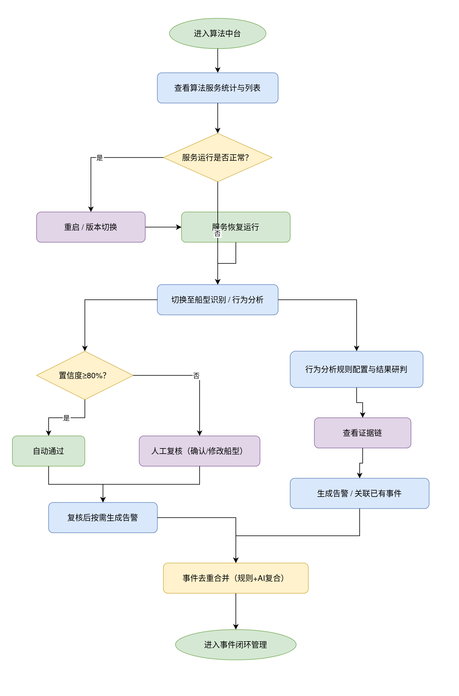
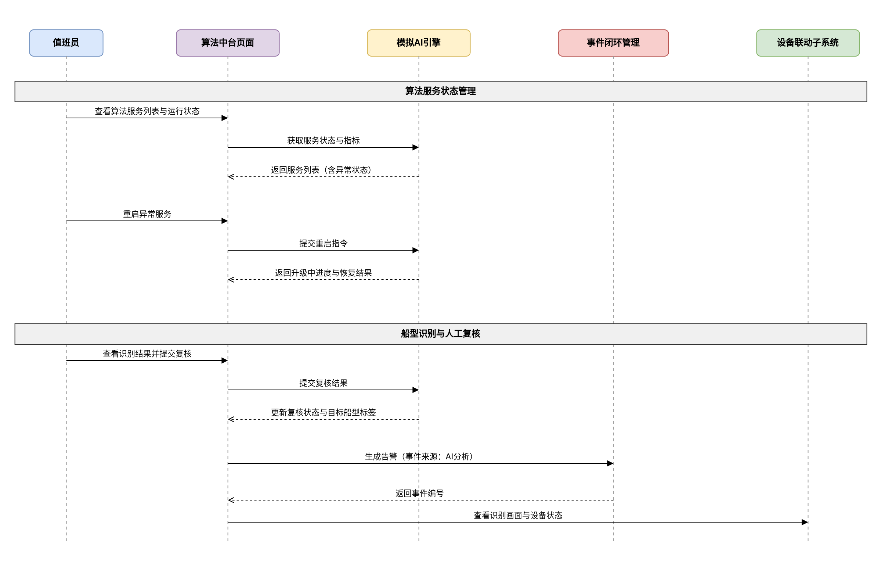
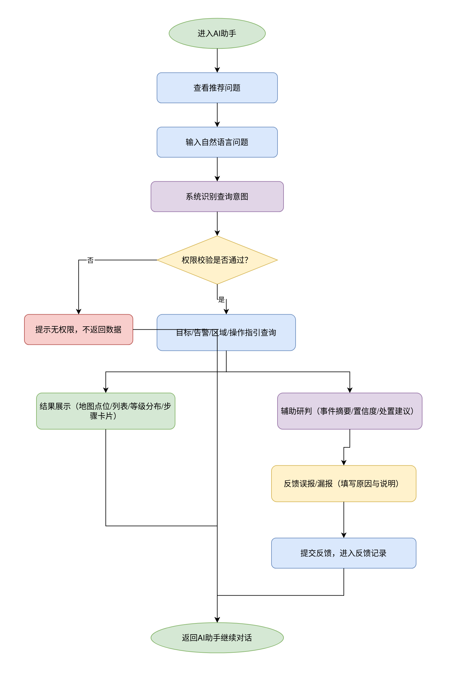
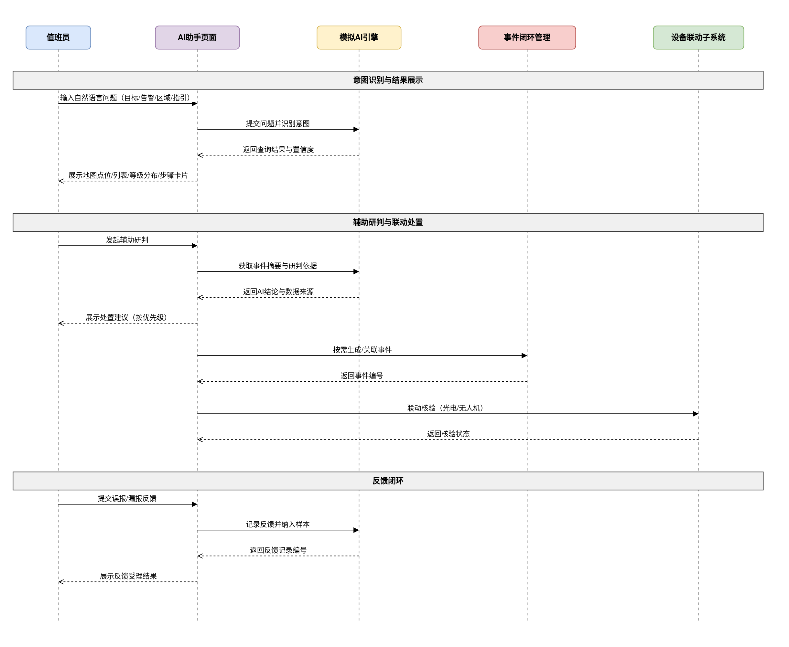
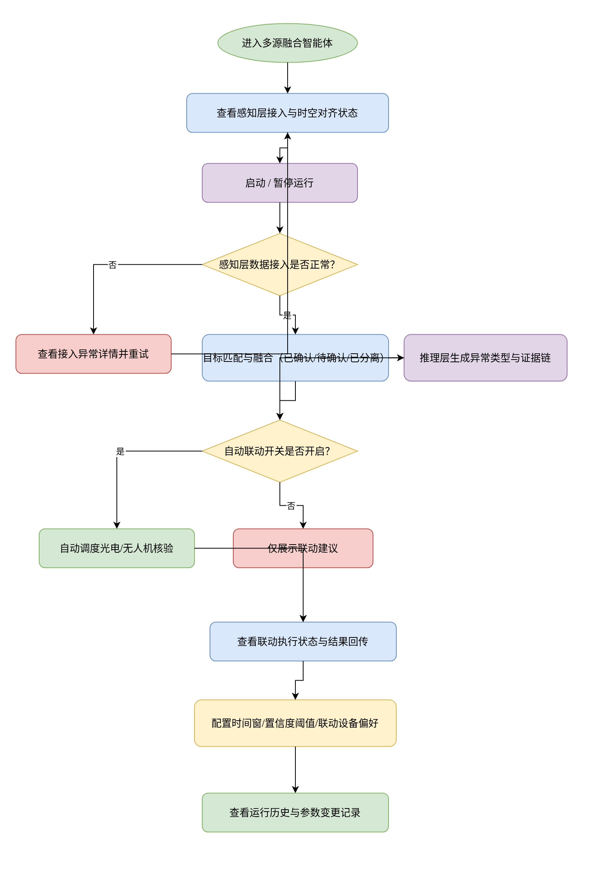
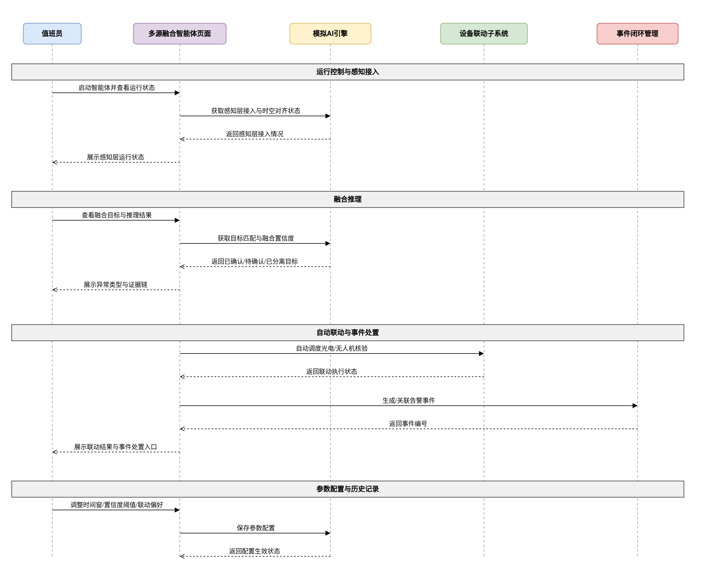

# 一、文档信息

| 项目名称 | 综合态势与多源感知系统-AI智能研判子系统 |
|---------|-----------------------------------|
| 文档版本 | V1.0 |
| 编制日期 | 2026-08-06 |
| 编制人 | - |
| 审核人 | - |
| 批准人 | - |
| 客户单位 | - |
| 编制单位 | - |
| 适用范围 | AI智能研判子系统——包含算法中台、AI助手、多源融合智能体（MIFA） |
| 核心目标 | 建立"规则兜底 + AI增强"的智能研判体系，统一管理AI算法服务，提供自然语言交互与辅助研判，实现多源融合智能体的感知-融合-推理-联动闭环 |
| 文档状态 | 草稿 |

**历史版本**

| 版本 | 日期 | 作者 | 更改说明 |
|-----|------|------|---------|
| V1.0 | 2026-08-06 | - | 初始版本 |

# 二、项目概述

## 2.1 项目背景

随着海上态势感知和预警处置业务的深化，综合态势与多源感知系统已具备预警事件管理、设备联动等能力，但目标研判环节仍面临以下挑战：

1. **多屏人工比对效率低**：雷达、AIS、光电、北斗等数据分散呈现，值班员需在多个画面之间切换比对，异常发现耗时较长，容易错过最佳处置时机。
2. **单源规则检测能力有限**：显式规则难以覆盖作业模式、异常绕行、频繁变向、接近重点目标等复杂行为，漏报与误报并存。
3. **研判结论缺少可解释性**：告警缺乏研判依据与证据链，值班员难以快速判断结论可信度，复核和事后追溯成本高。
4. **人机交互门槛高**：目标、告警、区域等查询依赖多套菜单操作，新值班员上手周期长，问题定位效率低。
5. **多源数据未形成协同研判**：各数据源独立呈现、缺少交叉验证，目标身份确认与行为研判缺少统一的融合视图，异常识别能力受限。

为解决上述问题，建设AI智能研判子系统，在既有预警事件与设备联动能力之上，形成"规则兜底 + AI增强"的双通道研判体系，输出可解释的AI研判结论与处置建议，提升海上态势管控和应急处置能力。

## 2.2 项目建设目标

本项目旨在建设AI智能研判子系统，实现以下目标：

1. **建立统一的AI算法服务管理能力**：统一管理船型识别、行为分析、风险评估、事件推荐等算法服务的运行状态、版本、数据源与授权设备，支持重启、版本切换与异常提示。
2. **实现船型识别与行为分析研判闭环**：基于光电视频识别船型，低置信度结果进入人工复核；识别作业模式与复杂异常行为，输出严重程度分级与证据链，可生成或关联告警事件。
3. **提供自然语言交互与辅助研判**：值班员通过多轮对话查询目标、告警、区域，获取事件摘要、AI结论、置信度、数据来源与按优先级排序的处置建议，并支持误报/漏报反馈。
4. **构建多源融合智能体闭环**：按感知-融合-推理-联动四层架构发现单源数据难以发现的异常，自动或按建议调度光电、无人机核验，并关联事件闭环管理。
5. **实现与行为预警的协同去重**：与预警规则管理中的行为预警形成"规则兜底 + AI增强"双通道，同目标、同行为类型、同一时间窗内事件去重合并，写入研判结论，降低重复告警与误报率。

## 2.3 项目建设范围

本项目建设范围包括：

**系统端**：
- PC端管理后台（Web应用）

**功能模块**：
- 算法中台：算法服务管理、船型识别、行为分析
- AI助手：自然语言交互、辅助研判、误报/漏报反馈
- 多源融合智能体：四层闭环、运行控制、参数配置、历史记录

**数据范围**：
- 算法服务数据（名称、类型、状态、版本、数据源、授权设备、调用量、延迟、准确率）
- 船型识别数据（识别时间、目标、来源设备、识别船型、置信度、复核状态、快照）
- 行为分析数据（作业模式、异常类型、严重程度、置信度、证据链、事件关联）
- 对话与反馈数据（会话消息、识别意图、结果数据、误报/漏报反馈）
- 多源融合数据（感知接入状态、融合目标、推理结果、联动动作、运行批次）
- 事件来源与去重记录（规则命中、AI分析、规则+AI复合）

**不包含的功能**：
- 真实算法训练、模型部署与推理服务（本阶段为前端原型 + 模拟AI引擎，页面结构与业务语义按真实系统设计，后续替换为真实算法与大模型服务）
- 行为预警规则本身的配置维护（由预警规则管理模块提供，本子系统仅协同其命中结果）
- 移动端H5/App（后续迭代实现）

## 2.4 业务流程图

## 2.5 业务角色定义

| 角色名称 | 角色描述 | 主要职责 | 权限范围 |
|---------|---------|---------|---------|
| 值班员 | 日常值班监控人员 | 查看AI研判结果、对话查询、辅助研判、提交反馈与处置建议 | 查看、复核、反馈、提交处置建议 |
| 指挥员 | 业务决策与管理人员 | 查看全部研判数据、确认处置建议、生成/关联事件、执行联动 | 全部功能模块 |
| 设备操作员 | 现场设备操作人员 | 执行智能体联动动作、查看联动执行状态 | 联动执行与状态查看 |
| 运维管理员 | 系统运维与配置人员 | 管理算法服务与版本、查看算法运行指标 | 算法服务管理（不含业务操作） |

## 2.6 术语表

| 术语 | 说明 |
|-----|------|
| AI智能研判 | 基于多源数据与算法模型对目标状态、行为、风险进行自动分析并输出结论的过程 |
| 算法中台 | 统一管理AI算法服务运行状态、版本、数据源与授权设备的模块 |
| 船型识别 | 基于光电视频自动识别目标船型并输出置信度的能力 |
| 行为分析 | 对目标作业模式与复杂异常行为进行识别与研判的能力 |
| 多源融合智能体 | 按感知-融合-推理-联动四层架构运行的智能化研判与联动闭环，英文缩写MIFA |
| 融合置信度 | 多源目标匹配后系统对同一目标身份确认的置信程度 |
| 证据链 | 支撑研判结论的数据来源、时间点、特征值与推理步骤的完整记录 |
| 规则+AI复合 | 规则与AI同时命中同一事件时合并后的主事件来源标记 |
| 时空对齐 | 多源数据按时间与空间坐标统一到同一参照系的过程 |
| 误报 | AI输出异常但实际情况正常，即虚警 |
| 漏报 | 实际存在异常但AI未识别出，即漏检 |

# 三、项目建设内容

## 3.1 总体功能架构

AI智能研判子系统作为综合态势与多源感知系统的一级菜单模块，包含以下功能结构：

**PC 端（管理后台）**

- AI智能研判（一级菜单）
  - 算法中台（二级菜单）
  - AI助手（二级菜单）
  - 多源融合智能体（二级菜单）

### 与预警规则管理的关系

本子系统采用"规则兜底 + AI增强"双通道，与预警规则管理中的行为预警互补协同，不替换、不重复告警：

- 行为预警继续负责航速异常、航向异常、异常停留、轨迹断线等显式规则检测。
- AI行为分析负责作业模式、异常绕行、频繁变向、接近重点目标等复杂模式检测。
- 同目标、同行为类型、同一时间窗内规则与AI重复命中时合并去重，主事件来源标记为"规则命中 / AI分析 / 规则+AI复合"。
- AI将研判结论写入规则事件，反馈结果进入误报治理，并可给出规则参数调整建议。
- 两者命中后均进入事件闭环管理，复用现有状态流转、派发处置与归档能力。

### 系统技术架构

AI智能研判子系统构建于综合态势与多源感知系统的整体技术架构之上，前端采用组件化单页应用，算法服务状态、识别结果、对话响应与智能体流水线由模拟AI引擎驱动，页面交互、数据流向与权限控制按真实系统设计，后续可平滑替换为真实算法与大模型服务。

> 系统架构图如下：

### 功能模块分层

| 层级 | 模块 | 核心职责 |
|------|------|---------|
| 展示交互层 | 算法中台 | 算法服务管理、船型识别、行为分析 |
| ^ | AI助手 | 自然语言交互、辅助研判、误报/漏报反馈 |
| ^ | 多源融合智能体 | 感知-融合-推理-联动四层闭环、运行控制 |
| 模拟AI引擎层 | 算法服务模拟 | 模拟服务状态、调用量、延迟、准确率与异常心跳 |
| ^ | 识别研判模拟 | 模拟船型识别、行为分析、意图识别与对话响应 |
| ^ | 融合推理模拟 | 模拟目标匹配、融合置信度、推理结果与联动动作 |
| 业务协同层 | 预警协同 | 与行为预警规则协同、事件去重与来源标记 |
| ^ | 事件协同 | 研判结果生成/关联告警事件，复用事件闭环管理 |
| ^ | 联动协同 | 调用光电、无人机核验并携带事件与目标上下文 |
| 数据管理层 | 算法服务库 | 服务信息、版本、数据源、授权设备与运行指标 |
| ^ | 识别研判库 | 识别结果、复核记录、行为分析结果与证据链 |
| ^ | 对话反馈库 | 会话消息、处置建议、反馈记录 |
| ^ | 融合联动库 | 融合目标、推理结果、联动动作与运行批次 |
| 数据接入层 | 多源数据接入 | 雷达、AIS、北斗、光电、频谱、气象数据接入 |

## 3.2 需求功能清单

| 序号 | 业务需求 | 需求概述 | 优先级 |
|-----|---------|---------|-------|
| 1 | 算法服务统一管理 | 统一维护船型识别、行为分析、风险评估、事件推荐等算法服务，支持查看状态、版本、数据源与授权设备 | P0 |
| 2 | 算法运行监控与异常处理 | 实时统计调用量、延迟、准确率，异常服务支持重启与版本切换，恢复后提示 | P1 |
| 3 | 船型识别与自动判定 | 基于光电视频识别渔船、货船、客船、快艇、橡皮艇、三无船，置信度达到阈值自动通过 | P0 |
| 4 | 低置信度人工复核 | 置信度不足的识别结果进入人工复核，支持确认或修改船型，记录复核痕迹 | P0 |
| 5 | 行为分析规则配置 | 配置作业模式识别、异常绕行、频繁变向、接近重点目标的参数与告警级别 | P1 |
| 6 | 复杂行为识别与分级研判 | 识别作业模式与复杂异常行为，按提示/一般/重要/紧急分级并输出研判依据 | P0 |
| 7 | 研判证据链追溯 | 展示参与分析的数据来源、时间点、特征值与推理步骤，支撑结论复核与追溯 | P1 |
| 8 | 告警生成与事件去重 | 研判结果可生成或关联告警事件，与行为预警规则按目标、行为类型、时间窗去重合并 | P0 |
| 9 | 自然语言多轮交互 | 值班员通过自然语言查询目标、告警、区域与操作指引，支持多轮追问，结果分区展示 | P0 |
| 10 | 辅助研判与处置建议 | 对目标或告警生成事件摘要、AI结论、置信度、数据来源与按优先级排序的处置建议 | P0 |
| 11 | 误报/漏报反馈 | 对识别、研判与对话结果提交误报/漏报反馈，记录原因与样本说明 | P2 |
| 12 | 多源融合四层闭环 | 按感知-融合-推理-联动四层架构运行，发现单源数据难以发现的异常 | P0 |
| 13 | 智能体运行控制 | 支持启动/暂停、自动联动开关、时间窗与置信度阈值配置 | P1 |
| 14 | 自动联动核验 | 推理结果达到阈值后自动或按建议调度光电、无人机核验，记录执行状态 | P0 |
| 15 | 历史记录与演示数据管理 | 按运行批次查看融合目标、推理结果、联动动作与日志，支持重置演示数据 | P2 |

## 3.3 页面功能清单

| 终端 | 一级菜单 | 二级菜单 | 子功能 | 功能描述 |
|-----|---------|---------|-------|---------|
| PC端 | AI智能研判 | 算法中台 | 服务统计 | 查看算法服务总数、运行中、异常、今日调用量 |
| ^ | ^ | ^ | 筛选 | 按服务名称、类型、运行状态筛选算法服务 |
| ^ | ^ | ^ | 列表 | 分页展示算法服务名称、类型、状态、版本、数据源、授权设备与运行指标 |
| ^ | ^ | ^ | 查看详情 | 查看服务配置、数据源明细、授权设备与近期调用趋势 |
| ^ | ^ | ^ | 重启 | 重启异常或停止的算法服务并查看进度 |
| ^ | ^ | ^ | 版本切换 | 选择目标版本并确认切换，记录切换时间与操作人 |
| ^ | ^ | ^ | 异常处理 | 查看异常服务详情，服务恢复后查看恢复提示 |
| ^ | ^ | ^ | 重置演示数据 | 一键恢复初始算法服务数据 |
| ^ | ^ | 船型识别 | 设备筛选 | 按光电设备筛选识别结果 |
| ^ | ^ | ^ | 识别结果列表 | 分页展示识别时间、目标、来源设备、识别船型、置信度与复核状态 |
| ^ | ^ | ^ | 查看快照 | 查看识别画面快照与识别结果 |
| ^ | ^ | ^ | 人工复核 | 确认或修改识别船型，填写复核结论 |
| ^ | ^ | ^ | 生成告警 | 复核后按需生成告警事件，来源标记为AI分析 |
| ^ | ^ | 行为分析 | 规则配置 | 配置作业模式识别、异常绕行、频繁变向、接近重点目标的参数与告警级别 |
| ^ | ^ | ^ | 分析结果列表 | 分页展示分析时间、目标、作业模式、异常类型、严重程度、置信度与关联事件 |
| ^ | ^ | ^ | 查看证据链 | 查看数据来源、时间点、特征值与推理步骤 |
| ^ | ^ | ^ | 生成告警 | 将分析结果生成告警事件，来源标记为AI分析 |
| ^ | ^ | ^ | 关联已有事件 | 按目标与时间窗关联规则事件，合并为规则+AI复合 |
| ^ | AI助手 | - | 推荐问题 | 查看常用问题快捷入口并点击提问 |
| ^ | ^ | - | 消息发送 | 输入自然语言问题并发送 |
| ^ | ^ | - | 多轮对话 | 查看历史消息并基于上下文继续追问 |
| ^ | ^ | - | 目标查询 | 查询目标信息，展示地图点位与目标列表 |
| ^ | ^ | - | 告警查询 | 查询告警信息，展示告警列表与等级分布 |
| ^ | ^ | - | 区域查询 | 查询区域信息，在地图上高亮区域 |
| ^ | ^ | - | 操作指引 | 查询操作步骤，展示步骤卡片并支持快捷跳转 |
| ^ | ^ | - | 辅助研判 | 查看事件摘要、AI结论、置信度、数据来源与处置建议 |
| ^ | ^ | - | 快捷操作 | 发起联动核验、派发事件、生成事件与反馈 |
| ^ | ^ | - | 反馈 | 提交误报/漏报反馈并查看受理结果 |
| ^ | 多源融合智能体 | - | 运行控制 | 启动或暂停智能体运行 |
| ^ | ^ | - | 自动联动开关 | 控制推理结果是否自动执行联动动作 |
| ^ | ^ | - | 感知层状态 | 查看多源数据接入状态、实时数据量与时空对齐成功率 |
| ^ | ^ | - | 融合层目标 | 查看目标匹配结果、数据源组合与融合置信度 |
| ^ | ^ | - | 推理层结果 | 查看异常类型、置信度、证据链与影响范围 |
| ^ | ^ | - | 联动层执行 | 查看联动动作类型、目标设备、状态与执行结果 |
| ^ | ^ | - | 参数配置 | 配置时间窗、置信度阈值与联动设备偏好 |
| ^ | ^ | - | 历史记录 | 按运行批次查看融合目标、推理结果、联动动作与日志 |
| ^ | ^ | - | 重置演示数据 | 一键恢复初始融合目标、推理结果与联动记录 |

## 3.4 页面访问权限

| 功能模块 | 值班员 | 指挥员 | 设备操作员 | 运维管理员 |
|---------|-------|-------|-----------|-----------|
| 算法中台——服务统计/列表/详情 | 查看 | 查看 | - | 查看 |
| 算法中台——重启/版本切换/异常处理 | - | 查看 | - | 全部权限 |
| 算法中台——重置演示数据 | - | 全部权限 | - | 全部权限 |
| 算法中台——船型识别结果查看 | 查看 | 查看 | 查看 | - |
| 算法中台——人工复核/生成告警 | 全部权限 | 全部权限 | - | - |
| 算法中台——行为分析规则配置 | - | 全部权限 | - | - |
| 算法中台——行为分析结果查看/证据链 | 查看 | 查看 | 查看 | - |
| 算法中台——行为分析生成告警/关联事件 | 全部权限 | 全部权限 | - | - |
| AI助手——对话/目标查询/告警查询/区域查询/操作指引 | 全部权限 | 全部权限 | 查看 | - |
| AI助手——辅助研判/反馈 | 全部权限 | 全部权限 | 查看 | - |
| AI助手——联动核验/派发事件/生成事件 | 查看 | 全部权限 | 全部权限 | - |
| 多源融合智能体——各层状态查看 | 查看 | 查看 | 查看 | - |
| 多源融合智能体——运行控制/参数配置 | 查看 | 全部权限 | - | - |
| 多源融合智能体——自动联动开关 | - | 全部权限 | - | - |
| 多源融合智能体——联动层执行 | - | 全部权限 | 全部权限 | - |
| 多源融合智能体——历史记录 | 查看 | 全部权限 | 查看 | 查看 |
| 多源融合智能体——重置演示数据 | - | 全部权限 | - | 全部权限 |

## 3.5 功能详细设计

### 3.5.1 算法中台

算法中台负责AI算法服务的统一管理与识别研判结果的复核处置，包含算法服务管理、船型识别、行为分析三个子模块。服务运行状态、识别结果、复核记录与分析证据均由模拟AI引擎统一输出，页面交互与业务规则按真实系统设计。

#### 3.5.1.1 算法服务管理

**（一）功能需求概述**

算法服务管理集中展示算法服务总数、运行状态与运行指标，支持对异常或已停止服务执行重启、切换版本、查看异常详情和重置演示数据，为船型识别、行为分析与融合推理提供可用服务保障。

**（二）功能设计**

**服务统计**

统计区展示算法服务总数、运行中数量、异常数量与今日调用量，数据随服务状态变化自动更新。

**查询/筛选功能**

支持以下条件筛选，条件之间为"与"关系，点击搜索按钮触发查询：

| 筛选字段 | 类型 | 说明 |
|---------|------|------|
| 服务名称 | 文本输入 | 支持模糊搜索 |
| 服务类型 | 下拉选择 | 全部/船型识别/行为分析/融合推理 |
| 运行状态 | 下拉选择 | 全部/运行中/异常/已停止 |

**列表功能**

| 列名 | 字段类型 | 说明 |
|-----|---------|------|
| 服务名称 | 文本 | - |
| 服务类型 | 标签 | 船型识别/行为分析/融合推理 |
| 运行状态 | 标签 | 运行中/异常/已停止 |
| 当前版本 | 文本 | 当前运行版本号 |
| 数据源 | 文本 | AIS/雷达/光电/北斗/频谱/气象等组合 |
| 授权设备 | 文本 | 授权接入的设备名称 |
| 运行指标 | 文本 | 平均延迟、准确率、最近心跳时间 |
| 操作 | 操作按钮 | 查看详情/重启/版本切换/异常处理 |

分页默认每页10条，支持切换每页数量。列表为空时显示"暂无算法服务数据"。

**查看详情**

查看服务基本信息、数据源配置、授权设备明细与近期调用趋势。

| 字段名称 | 类型 | 说明 |
|---------|------|------|
| 基本信息 | 文本 | 服务名称、类型、状态、当前版本 |
| 数据源配置 | 文本 | 数据源类型、接入状态、更新频率 |
| 授权设备 | 列表 | 设备名称、设备类型、接入状态 |
| 近期调用趋势 | 图表 | 今日调用量、成功率、平均延迟走势 |

**重启**

对运行状态为"异常"或"已停止"的服务执行重启，系统展示重启进度，完成后服务状态更新为"运行中"。重启中服务不可再次重启，提示"服务正在重启，请稍后再试"。重启失败时提示"服务重启失败，请查看异常处理"。

**版本切换**

点击"版本切换"，选择目标版本并填写切换原因后提交。

| 字段名称 | 类型 | 长度限制 | 必填 | 默认值 | 说明 |
|---------|------|---------|------|-------|------|
| 目标版本 | 下拉选择 | - | 是 | - | 系统内可用的历史版本 |
| 切换原因 | 文本输入 | 2-200字 | 是 | - | 记录本次切换原因 |

提交成功：提示"版本切换成功"。
版本切换期间不可重复操作，提示"版本切换中，请稍后再试"。
切换失败时保留当前版本运行，提示"版本切换失败，已保留原版本"。

**异常处理**

运行状态为"异常"的服务在列表中标记异常状态，点击"异常处理"查看异常详情。

| 列名 | 字段类型 | 说明 |
|-----|---------|------|
| 异常时间 | 日期时间 | 服务最近一次异常时间 |
| 异常类型 | 文本 | 心跳超时/数据源断开/运行错误 |
| 异常描述 | 文本 | 具体错误信息 |
| 影响范围 | 文本 | 受影响的功能与数据范围 |
| 恢复状态 | 标签 | 已恢复/未恢复 |

服务恢复后列表同步显示恢复提示，异常处理详情中恢复状态更新为"已恢复"。

**重置演示数据**

点击"重置演示数据"，弹出确认"确定重置全部演示数据吗？重置后将恢复初始算法服务数据。"确认后恢复初始算法服务数据。重置成功：提示"演示数据已重置"。

**业务规则**

- 服务处于"启动中"或"版本切换中"状态时，重启与版本切换按钮不可操作，提示"服务正在处理中，请稍后再试"。
- 服务异常后停止接收新的识别请求，船型识别、行为分析与多源融合智能体相关结果同步展示"算法服务异常，结果可能延迟或缺失"，服务恢复后自动恢复。
- 重置演示数据后全部算法服务恢复为初始演示状态，历史调用记录保留并标记"已重置"。

**边界与异常**

- **空数据**：列表无数据时，显示"暂无算法服务数据"
- **权限不足**：重启、版本切换、异常处理、重置演示数据按钮对无权限角色完全隐藏
- **服务异常**：列表标记异常状态，详情展示异常原因与恢复提示
- **切换失败**：保留原版本运行，提示"版本切换失败，已保留原版本"

**（三）业务逻辑关联**

- 算法服务状态异常时，船型识别、行为分析、多源融合智能体相关结果同步展示服务异常提示
- 版本切换成功后，新识别结果按新版本规则输出，历史结果保留原版本标记
- 重置演示数据影响算法中台全部演示数据，不影响事件闭环与设备联动中的真实数据

#### 3.5.1.2 船型识别

**（一）功能需求概述**

船型识别基于光电设备画面自动输出识别船型与置信度，值班员可查看识别快照并人工复核，复核确认或修改后按需生成告警，事件来源标记为"AI分析"。

**（二）功能设计**

**设备筛选**

| 筛选字段 | 类型 | 说明 |
|---------|------|------|
| 光电设备 | 下拉选择 | 全部/在线/离线，来源于光电设备中已启用的设备 |
| 识别时间 | 日期范围 | 选择开始和结束日期 |
| 复核状态 | 下拉选择 | 全部/待复核/已通过/已修改 |

条件之间为"与"关系，点击搜索按钮触发查询。

**识别结果列表**

| 列名 | 字段类型 | 说明 |
|-----|---------|------|
| 识别时间 | 日期时间 | - |
| 目标 | 文本 | 目标名称或编号 |
| 来源设备 | 文本 | 光电设备名称 |
| 识别船型 | 文本 | 渔船/货船/客船/快艇/橡皮艇/三无船 |
| 置信度 | 百分比 | 0-100% |
| 复核状态 | 标签 | 待复核/已通过/已修改 |
| 操作 | 操作按钮 | 查看快照/人工复核 |

分页默认每页10条，支持切换每页数量。列表为空时显示"暂无船型识别结果"。

**查看快照**

点击"查看快照"，展示识别画面快照与识别结果，快照包含识别时间、目标、来源设备、识别船型与置信度。

**人工复核**

点击"人工复核"，进入复核页面。

| 字段名称 | 类型 | 长度限制 | 必填 | 默认值 | 说明 |
|---------|------|---------|------|-------|------|
| 识别船型 | 下拉选择 | - | 是 | 当前识别值 | 渔船/货船/客船/快艇/橡皮艇/三无船 |
| 复核结论 | 下拉选择 | - | 是 | 确认无误 | 确认无误/修改船型 |
| 复核说明 | 文本输入 | 0-200字 | 否 | - | 修改船型时建议填写原因 |

提交成功：提示"复核成功"。
置信度大于等于80%的识别结果自动标记"已通过"，置信度低于80%的结果进入"待复核"状态。

**生成告警**

复核为"确认无误"或"修改船型"后，可按需生成告警事件。生成成功后提示"告警已生成"，事件来源标记为"AI分析"。

**业务规则**

- 识别置信度大于等于80%时结果自动通过，标记为"已通过"，无需人工复核。
- 置信度低于80%的结果保持"待复核"，完成复核前不可生成告警，提示"请先完成人工复核"。
- 同一目标在同一识别批次内仅保留一条待复核记录，重复识别结果自动合并。
- 复核结论为"修改船型"时，修改后的船型作为最终结论，生成告警时使用最终船型。

**边界与异常**

- **空数据**：列表无数据时，显示"暂无船型识别结果"
- **权限不足**：人工复核、生成告警按钮对无权限角色完全隐藏
- **来源设备离线**：历史识别结果仍可查看，新增识别暂停，页面提示"来源设备离线，暂停新增识别"
- **快照缺失**：快照不可用时展示占位图，识别字段信息保留

**（三）业务逻辑关联**

- 来源设备来源于光电设备中已启用的设备，离线设备不可被选择
- 复核结果保存至识别研判库，作为船型识别准确率统计依据
- 生成告警后进入事件闭环管理，事件来源标记为"AI分析"

#### 3.5.1.3 行为分析

**（一）功能需求概述**

行为分析识别作业模式、异常绕行、频繁变向、接近重点目标等复杂行为模式，支持规则参数配置、分析结果查看、证据链查看、生成告警与关联已有事件，与预警规则管理中的行为预警形成"规则+AI"协同研判。

**（二）功能设计**

**规则配置**

| 字段名称 | 类型 | 长度限制 | 必填 | 默认值 | 说明 |
|---------|------|---------|------|-------|------|
| 行为类型 | 下拉选择 | - | 是 | - | 作业模式识别/异常绕行/频繁变向/接近重点目标 |
| 判定参数 | 数字输入 | - | 是 | - | 各行为类型对应的速度、角度、次数、距离等参数 |
| 告警级别 | 下拉选择 | - | 是 | 一般 | 提示/一般/重要/紧急 |
| 状态 | 开关 | - | 是 | 启用 | 启用/停用 |

提交成功：提示"保存成功"。
停用的行为类型不再输出新的分析结果，已有结果不受影响。

**分析结果列表**

| 列名 | 字段类型 | 说明 |
|-----|---------|------|
| 分析时间 | 日期时间 | - |
| 目标 | 文本 | 目标名称或编号 |
| 作业模式 | 文本 | 捕捞/航行/停泊等识别结果 |
| 异常类型 | 文本 | 作业模式异常/异常绕行/频繁变向/接近重点目标 |
| 严重程度 | 标签 | 低/中/高 |
| 置信度 | 百分比 | 0-100% |
| 关联事件 | 文本 | 关联的事件编号，未关联显示"-" |
| 操作 | 操作按钮 | 查看证据链/生成告警/关联已有事件 |

分页默认每页10条，支持切换每页数量。列表为空时显示"暂无行为分析结果"。

**查看证据链**

| 列名 | 字段类型 | 说明 |
|-----|---------|------|
| 数据来源 | 文本 | AIS/雷达/北斗/光电等 |
| 时间点 | 日期时间 | 证据发生时间 |
| 特征值 | 文本 | 速度、航向、距离、变向次数等特征数值 |
| 推理步骤 | 文本 | 从数据输入到结论输出的推理过程描述 |

**生成告警**

将分析结果生成告警事件，事件来源标记为"AI分析"。生成成功：提示"告警已生成"。
同一结果已生成告警后不可重复操作，提示"该结果已生成告警"。

**关联已有事件**

| 筛选字段 | 类型 | 说明 |
|---------|------|------|
| 事件编号 | 文本输入 | 支持模糊搜索 |
| 行为类型 | 下拉选择 | 全部/行为预警对应类型 |
| 时间窗 | 日期时间范围 | 按目标与时间窗查找事件 |

选择已有规则事件并确认关联后，来源标记更新为"规则+AI复合"。关联成功：提示"关联成功"。

**业务规则**

- 同目标、同行为类型、同一时间窗内规则与AI重复命中时合并为一条记录，主事件来源标记为"规则+AI复合"。
- 已生成告警或已关联事件的分析结果不可重复操作，分别提示"该结果已生成告警""该结果已关联事件"。
- 行为类型停用后不再产生新结果，历史结果保留并可继续查看证据链。

**边界与异常**

- **空数据**：列表无数据时，显示"暂无行为分析结果"
- **权限不足**：规则配置、生成告警、关联已有事件按钮对无权限角色完全隐藏
- **证据链不完整**：部分数据源缺失时展示已有证据并在证据链中标记"数据缺失"
- **关联冲突**：同一结果已关联其他事件时阻止重复关联，提示"该结果已关联事件"

**（三）业务逻辑关联**

- 与行为预警采用"规则兜底+AI增强"双通道，同目标、同行为类型、同一时间窗内结果合并去重
- AI将研判结论保存至规则事件，反馈结果进入误报治理
- 生成告警或关联事件后进入事件闭环管理，复用现有状态流转、派发处置与归档能力

**（四）用户操作流程图**

**（五）功能时序图**

### 3.5.2 AI助手

**（一）功能需求概述**

AI助手提供自然语言交互入口，支持目标、告警、区域、操作指引查询与辅助研判，通过多轮对话完成上下文追问与快捷操作，并将误报/漏报反馈纳入误报治理。

**（二）功能设计**

**推荐问题**

对话起始区展示推荐问题快捷入口，点击后自动发送对应问题，无需二次确认。推荐问题覆盖目标查询、告警查询、区域查询、操作指引与辅助研判示例。

**消息发送**

| 字段名称 | 类型 | 长度限制 | 必填 | 默认值 | 说明 |
|---------|------|---------|------|-------|------|
| 输入内容 | 文本输入 | 1-500字 | 是 | - | 支持自然语言提问 |

发送后展示用户消息与AI响应。输入为空时不可发送，提示"请输入问题"。

**多轮对话**

历史消息按时间顺序分区展示，用户可基于上下文继续追问。系统识别当前问题与前序问题的关联意图，同一会话内连续追问时携带上下文，识别为新问题时重新开始意图识别。

**意图识别**

| 意图类型 | 结果展示 |
|---------|---------|
| 目标查询 | 展示地图点位与目标列表 |
| 告警查询 | 展示告警列表与等级分布 |
| 区域查询 | 在地图上高亮匹配区域 |
| 操作指引 | 展示步骤卡片并支持快捷跳转 |
| 辅助研判 | 展示事件摘要、AI结论、置信度、数据来源与处置建议 |

**目标查询**

| 列名 | 字段类型 | 说明 |
|-----|---------|------|
| 目标名称 | 文本 | - |
| 位置 | 地图点位 | 地图上显示目标位置 |
| 状态 | 文本 | 正常/关注/异常 |
| 数据来源 | 文本 | AIS/雷达/北斗/光电等 |

地图点位与目标列表联动，点击目标列表定位地图点位。

**告警查询**

| 列名 | 字段类型 | 说明 |
|-----|---------|------|
| 告警编号 | 文本 | - |
| 告警类型 | 文本 | - |
| 等级 | 标签 | 提示/一般/重要/紧急 |
| 发生时间 | 日期时间 | - |
| 处置状态 | 文本 | - |

同时展示告警等级分布，供值班员快速判断风险面。

**区域查询**

展示匹配区域列表与地图高亮区域，点击区域列表联动地图定位。无匹配结果时提示"未找到相关区域"。

**操作指引**

| 列名 | 字段类型 | 说明 |
|-----|---------|------|
| 步骤序号 | 数字 | 按顺序排列 |
| 操作内容 | 文本 | 操作步骤说明 |
| 跳转入口 | 操作按钮 | 点击进入对应功能页面 |

步骤卡片按顺序展示，支持快捷跳转。

**辅助研判**

| 字段名称 | 类型 | 说明 |
|---------|------|------|
| 事件摘要 | 文本 | 事件类型、目标、时间、位置摘要 |
| AI结论 | 文本 | 研判结论 |
| 置信度 | 百分比 | 0-100% |
| 数据来源 | 文本 | AIS/雷达/北斗/光电/频谱/气象 |
| 处置建议 | 列表 | 按优先级排序的建议步骤 |
| 快捷操作 | 操作按钮 | 联动核验/派发事件/生成事件/反馈 |

**快捷操作**

- 联动核验：携带事件与目标上下文发起联动核验
- 派发事件：将事件派发至处置人员
- 生成事件：将研判结论生成告警事件
- 反馈：进入反馈提交

**反馈**

| 字段名称 | 类型 | 长度限制 | 必填 | 默认值 | 说明 |
|---------|------|---------|------|-------|------|
| 反馈类型 | 下拉选择 | - | 是 | - | 误报/漏报 |
| 反馈原因 | 多选 | - | 是 | - | 天气干扰/算法误判/参数不当/其他 |
| 样本说明 | 文本输入 | 0-200字 | 否 | - | 补充说明 |

提交成功：提示"反馈已提交"。反馈记录进入误报治理，受理后展示受理结果。

**业务规则**

- 同一会话内连续问题按多轮对话处理，识别为新问题时重新开始意图识别，历史消息保留。
- 辅助研判仅对已生成或已关联事件的结果提供联动核验、派发事件快捷操作，未关联时提示"请先关联或生成事件"。
- 同一反馈样本不可重复提交相同反馈类型，提示"该样本已提交反馈"。

**边界与异常**

- **空数据**：查询无结果时，显示"未找到相关结果"
- **权限不足**：快捷操作按钮对无权限角色完全隐藏
- **意图无法识别**：提示"未理解您的问题，请换一种说法或使用推荐问题"
- **事件未关联**：联动核验、派发事件不可操作，提示"请先关联或生成事件"

**（三）业务逻辑关联**

- 目标、告警、区域查询数据来源于态势感知与预警事件相关数据，查询结果随源数据更新
- 辅助研判结果可生成或关联事件，进入事件闭环管理
- 反馈结果进入误报治理，作为行为预警与AI行为分析参数调整依据

**（四）用户操作流程图**

**（五）功能时序图**

### 3.5.3 多源融合智能体

**（一）功能需求概述**

多源融合智能体按"感知-融合-推理-联动"四层架构运行，将雷达、AIS、北斗、光电、频谱、气象多源数据时空对齐后进行目标匹配与异常推理，输出证据链并自动或手动触发联动动作，形成智能研判与处置闭环。

**（二）功能设计**

**运行控制**

启动或暂停智能体运行。启动后各层状态自动刷新；暂停后停止新的融合与推理输出，已有结果保留，页面提示"智能体已暂停"。

**自动联动开关**

控制推理结果是否自动执行联动动作。开启后，达到置信度阈值的推理结果自动调用光电、无人机核验；关闭后仅生成联动建议，由操作人员手动执行。

**感知层状态**

| 列名 | 字段类型 | 说明 |
|-----|---------|------|
| 数据源 | 文本 | 雷达/AIS/北斗/光电/频谱/气象 |
| 接入状态 | 标签 | 在线/离线/异常 |
| 实时数据量 | 数字 | 最近时段数据条数 |
| 时空对齐成功率 | 百分比 | 最近统计周期对齐成功率 |
| 最近更新时间 | 日期时间 | - |

**融合层目标**

| 列名 | 字段类型 | 说明 |
|-----|---------|------|
| 目标名称 | 文本 | - |
| 数据源组合 | 文本 | AIS+雷达、光电+雷达等 |
| 匹配结果 | 标签 | 已确认/待确认/已分离 |
| 融合置信度 | 百分比 | 0-100% |
| 最近位置 | 文本 | 经度,纬度 |

匹配结果为"待确认"的目标需人工确认身份，确认后更新为"已确认"。

**推理层结果**

| 列名 | 字段类型 | 说明 |
|-----|---------|------|
| 推理时间 | 日期时间 | - |
| 目标名称 | 文本 | - |
| 异常类型 | 文本 | 异常停留/异常绕行/频繁变向/接近重点目标/作业模式异常 |
| 置信度 | 百分比 | 0-100% |
| 严重程度 | 标签 | 低/中/高 |
| 影响范围 | 文本 | 受影响区域与目标范围 |
| 证据链 | 操作按钮 | 查看数据来源、时间点、特征值与推理步骤 |

**联动层执行**

| 列名 | 字段类型 | 说明 |
|-----|---------|------|
| 联动动作 | 文本 | 光电核验/无人机调度等 |
| 目标设备 | 文本 | 执行设备名称 |
| 执行状态 | 标签 | 待执行/执行中/成功/失败 |
| 执行结果 | 文本 | 返回结果描述 |
| 执行时间 | 日期时间 | - |

**参数配置**

| 字段名称 | 类型 | 长度限制 | 必填 | 默认值 | 说明 |
|---------|------|---------|------|-------|------|
| 时间窗 | 数字输入 | - | 是 | 5分钟 | 融合与推理使用的时间窗口 |
| 置信度阈值 | 数字输入 | 0-100 | 是 | 80% | 自动联动的最低置信度 |
| 联动设备偏好 | 多选 | - | 是 | 光电优先 | 可执行的联动设备类型 |

提交成功：提示"参数已保存"。
置信度阈值修改后仅对后续推理结果生效，历史结果不变。

**历史记录**

| 列名 | 字段类型 | 说明 |
|-----|---------|------|
| 运行批次 | 文本 | 批次编号 |
| 开始时间 | 日期时间 | - |
| 结束时间 | 日期时间 | - |
| 融合目标数 | 数字 | - |
| 推理结果数 | 数字 | - |
| 联动动作数 | 数字 | - |
| 日志摘要 | 文本 | 各层运行日志摘要 |

点击批次可查看该批次全部融合目标、推理结果与联动动作。

**重置演示数据**

点击"重置演示数据"，弹出确认"确定重置多源融合智能体演示数据吗？"确认后恢复初始融合目标、推理结果与联动记录。重置成功：提示"演示数据已重置"。

**业务规则**

- 智能体暂停期间不产生新的融合与推理结果，联动层待执行动作保留，恢复运行后继续执行。
- 自动联动开启时，仅置信度不低于阈值的推理结果自动执行联动，低于阈值的结果生成联动建议等待人工确认，提示"该结果未达到自动联动阈值，请人工确认"。
- 融合层匹配结果为"待确认"时，不输出该目标的自动联动动作，身份确认后恢复。
- 时间窗与置信度阈值修改后仅对后续推理结果生效，历史记录保持不变。

**边界与异常**

- **空数据**：各层列表无数据时，显示"暂无[数据名]数据"
- **权限不足**：运行控制、参数配置、自动联动开关、联动层执行、重置演示数据按钮对无权限角色完全隐藏
- **数据源离线**：感知层标记离线，时空对齐成功率停止更新，页面提示"数据源离线，融合结果可能不完整"
- **联动失败**：联动层标记失败并记录失败原因，支持重新执行
- **目标分离**：已确认目标数据源中断后标记"已分离"，不再参与推理输出

**（三）业务逻辑关联**

- 感知层数据来源于雷达、AIS、北斗、光电、频谱、气象多源数据接入
- 推理结果可生成或关联告警事件，联动动作复用设备联动子系统的光电与无人机能力
- 联动执行结果保存至融合联动库，并作为事件闭环管理中的处置证据

**（四）用户操作流程图**

**（五）功能时序图**

# 四、技术方案

## 4.1 技术架构

本阶段采用"前端原型 + 模拟AI引擎"建设方式，整体沿用综合态势与多源感知系统的技术架构：

- 前端：组件化单页应用，按算法中台、AI助手、多源融合智能体三个功能域组织页面，复用统一菜单、权限、地图与事件展示能力
- 模拟AI引擎：独立运行的算法模拟层，负责算法服务心跳与调用量、船型识别、行为分析、对话响应、融合推理与联动动作的生成，输出格式与真实算法接口对齐
- 数据存储：算法服务库、识别研判库、对话反馈库、融合联动库，演示数据独立初始化，后续真实算法接入时可平滑替换模拟数据源
- 部署：与综合态势与多源感知系统同环境部署，演示数据随系统启动自动初始化

## 4.2 数据交互

- 页面与模拟AI引擎之间通过统一数据通道交互，交互内容包括服务状态、识别结果、复核记录、对话消息、融合目标、推理结果与联动动作
- 数据格式采用结构化定义，字段命名与正式算法接入规范一致，后续真实算法接入时页面无需变更
- 页面不直接处理算法细节，识别、推理与对话响应均由模拟AI引擎统一输出
- 与预警规则管理、事件闭环管理、设备联动子系统的协同通过既有业务数据通道完成，规则命中与AI分析结果按统一事件模型合并

## 4.3 安全方案

- 身份认证：复用系统统一账号体系，登录后进入AI智能研判子系统
- 权限控制：按角色控制页面与按钮访问，无权限按钮直接隐藏
- 数据安全：对话内容、复核结论、版本切换与联动记录完整留痕，可按时间与操作人追溯
- 演示数据隔离：模拟AI引擎产生的演示数据独立存储，不污染真实业务数据

# 五、非功能需求

## 5.1 性能需求

- 页面加载时间小于3秒，列表查询响应时间小于1秒
- 算法服务状态刷新间隔不超过30秒，感知层状态刷新间隔不超过10秒
- 对话响应时间小于3秒，多轮对话连续追问响应时间小于5秒
- 支持不少于100个并发用户

## 5.2 安全需求

- 基于角色的访问控制，越权操作不可发起
- 复核、版本切换、联动执行等关键操作记录操作人与操作时间
- 对话与研判数据仅在授权范围内展示，数据导出需通过权限校验

## 5.3 可用性需求

- 系统可用性不低于99.5%
- 算法服务异常时页面可正常访问，同步展示服务异常提示
- 演示数据重置后系统可立即恢复初始状态，无需重启

## 5.4 兼容性需求

- 浏览器：Chrome、Firefox、Safari、Edge最新版本
- 分辨率：1920×1080、1536×864、1366×768
- 地图与列表交互支持鼠标操作，兼容常用显示器分辨率

# 六、数据需求

## 6.1 数据字典

| 枚举类型 | 枚举值 | 说明 |
|---------|-------|------|
| 算法服务状态 | 运行中 | 服务运行正常 |
| ^ | 异常 | 心跳超时、数据源断开或运行错误 |
| ^ | 已停止 | 服务已停止运行 |
| ^ | 启动中 | 重启或版本切换处理中 |
| 复核状态 | 待复核 | 置信度低于80%，等待人工复核 |
| ^ | 已通过 | 置信度大于等于80%或人工确认无误 |
| ^ | 已修改 | 人工修改船型后通过 |
| 船型 | 渔船 | - |
| ^ | 货船 | - |
| ^ | 客船 | - |
| ^ | 快艇 | - |
| ^ | 橡皮艇 | - |
| ^ | 三无船 | - |
| 严重程度 | 低 | 影响范围小 |
| ^ | 中 | 影响范围中等 |
| ^ | 高 | 影响范围大 |
| 异常类型 | 作业模式异常 | 作业行为偏离正常模式 |
| ^ | 异常绕行 | 目标出现不合理绕行 |
| ^ | 频繁变向 | 目标航向频繁改变 |
| ^ | 接近重点目标 | 目标接近重点目标或区域 |
| 融合状态 | 已确认 | 多源目标匹配确认 |
| ^ | 待确认 | 等待人工确认身份 |
| ^ | 已分离 | 数据源中断或匹配失败 |
| 联动状态 | 待执行 | 联动动作等待执行 |
| ^ | 执行中 | 联动动作正在执行 |
| ^ | 成功 | 联动动作执行成功 |
| ^ | 失败 | 联动动作执行失败 |
| 反馈类型 | 误报 | AI输出异常但实际情况正常 |
| ^ | 漏报 | 实际存在异常但AI未识别出 |
| 反馈原因 | 天气干扰 | 恶劣天气影响识别效果 |
| ^ | 算法误判 | 算法输出结论错误 |
| ^ | 参数不当 | 规则参数设置不合理 |
| ^ | 其他 | 其他原因 |
| 事件来源 | 规则命中 | 行为预警规则触发 |
| ^ | AI分析 | AI智能研判识别 |
| ^ | 规则+AI复合 | 规则与AI同时命中并合并 |

## 6.2 数据存储要求

- 算法服务库：保存服务信息、版本、数据源、授权设备与运行指标，支持演示数据重置
- 识别研判库：保存船型识别、复核记录、行为分析结果与证据链，历史结果保留原版本标记
- 对话反馈库：保存会话消息、意图结果、处置建议与反馈记录
- 融合联动库：保存融合目标、推理结果、联动动作与运行批次
- 演示数据与真实业务数据隔离存储，重置操作不影响其他子系统
- 关键操作留痕数据长期保留，支持按时间与操作人追溯

# 七、接口需求

本阶段采用"前端原型 + 模拟AI引擎"，页面所需数据均由模拟数据通道提供，正式算法接入后按统一数据规范对接。

## 7.1 模拟数据通道

- 算法服务管理、船型识别、行为分析、AI助手对话、多源融合智能体各层数据均通过模拟数据通道提供
- 模拟数据格式、字段命名与正式算法接入规范一致，后续替换真实算法与大模型服务时页面无需变更

## 7.2 系统协同

- 与预警规则管理：接收规则命中结果，输出AI研判结论与"规则+AI复合"标记
- 与事件闭环管理：生成或关联告警事件，写回研判结论与联动执行结果
- 与设备联动子系统：发起光电核验与无人机调度联动动作，接收执行结果

# 八、项目实施与验收

## 8.1 实施阶段

1. **需求确认阶段**（2周）：需求评审、原型确认、需求基线锁定
2. **设计开发阶段**（6周）：详细设计、前端原型开发、模拟AI引擎开发
3. **测试部署阶段**（2周）：功能测试、性能测试、用户验收测试、部署上线
4. **上线运行阶段**（2周）：试运行、问题修复、正式上线

## 8.2 系统培训服务

- **培训对象**：值班员、指挥员、设备操作员、运维管理员
- **培训内容**：算法中台操作、AI助手对话与反馈、多源融合智能体运行控制与联动操作
- **培训方式**：现场培训、在线培训、操作手册

## 8.3 验收标准

- **功能验收**：算法中台、AI助手、多源融合智能体功能按SRS实现，3.2需求功能清单无缺失，无P0/P1级缺陷
- **性能验收**：满足第五章非功能需求指标
- **数据验收**：演示数据可重置，关键操作留痕完整
- **文档验收**：提供设计方案、操作手册与验收报告

# 九、附录

## 附录A：术语表

| 术语 | 说明 |
|-----|------|
| MIFA | 多源融合智能体（Multi-source Intelligent Fusion Agent） |
| MMSI | 海上移动业务标识（Maritime Mobile Service Identity），船舶唯一标识 |
| AIS | 船舶自动识别系统（Automatic Identification System） |
| 北斗 | 北斗卫星导航系统，提供目标位置与短报文通信 |
| 置信度 | 模型对识别或推理结论的把握程度 |
| 证据链 | 支撑研判结论的数据来源、时间点、特征值与推理步骤记录 |
| 时空对齐 | 多源数据按时间与空间坐标统一到同一参照系的过程 |
| 规则+AI复合 | 规则与AI同时命中同一事件时的主事件来源标记 |
| 误报 | AI输出异常但实际情况正常，即虚警 |
| 漏报 | 实际存在异常但AI未识别出，即漏检 |
| SRS | 软件需求规格说明书（Software Requirements Specification） |

## 附录B：参考资料

- 《综合态势与多源感知系统-SRS需求规格说明书》V1.0
- 《综合态势与多源感知系统-设备联动子系统-SRS需求规格说明书》V1.0
- 《综合态势与多源感知系统-AI智能研判子系统-设计方案》V1.0
- 《综合态势与多源感知功能清单》
