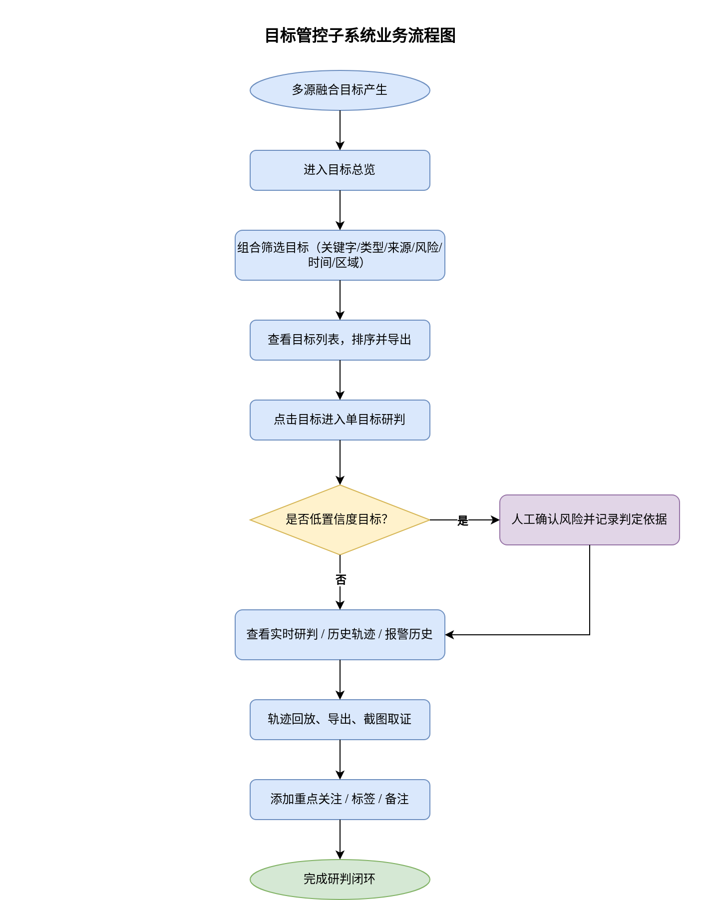
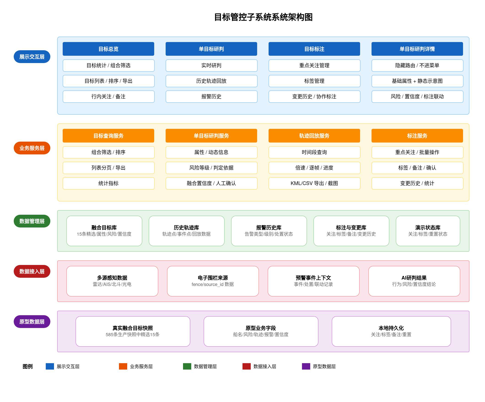
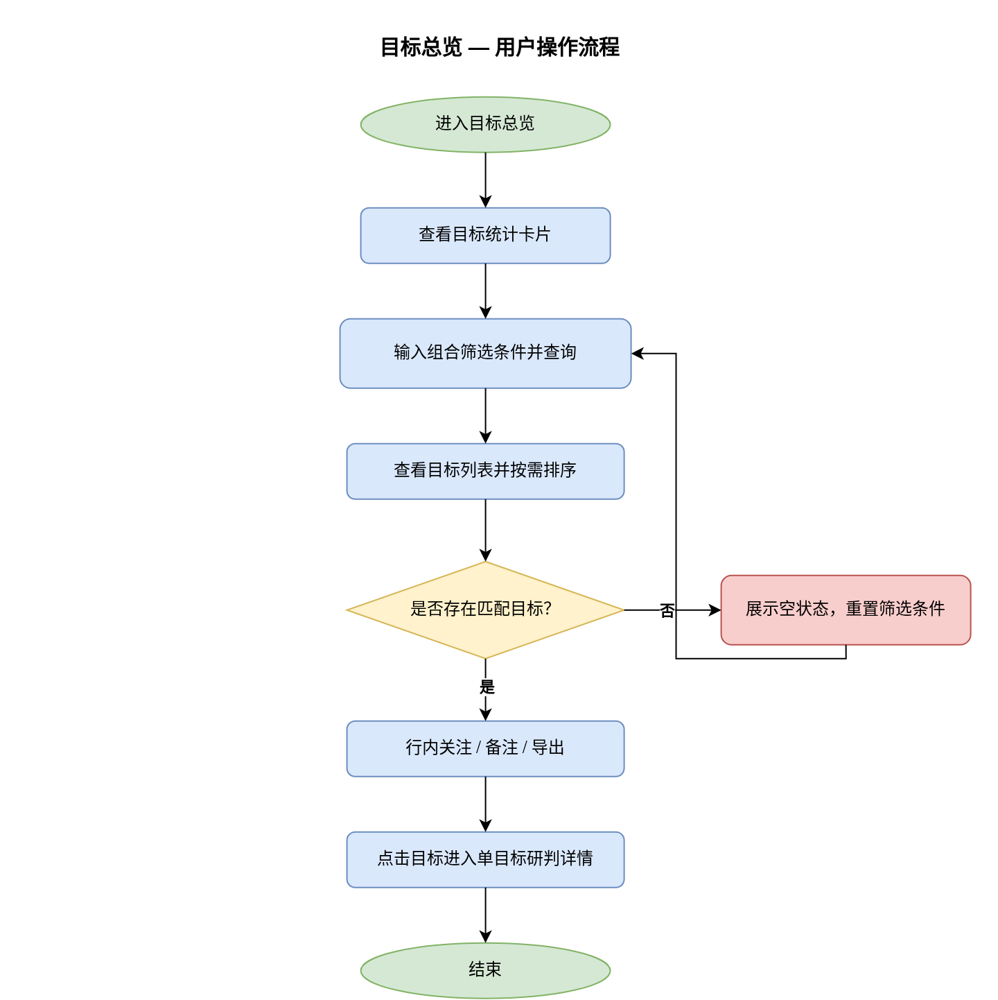
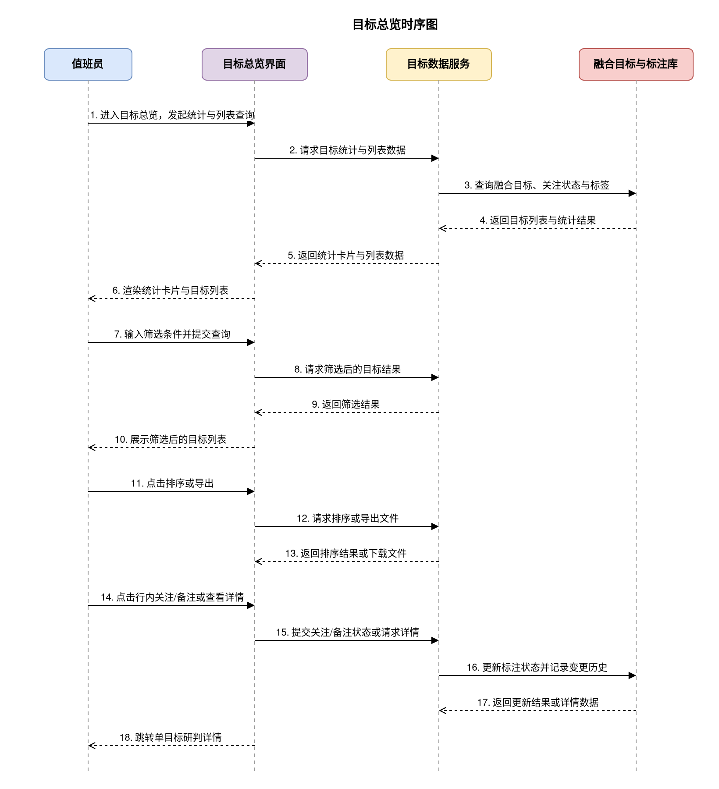
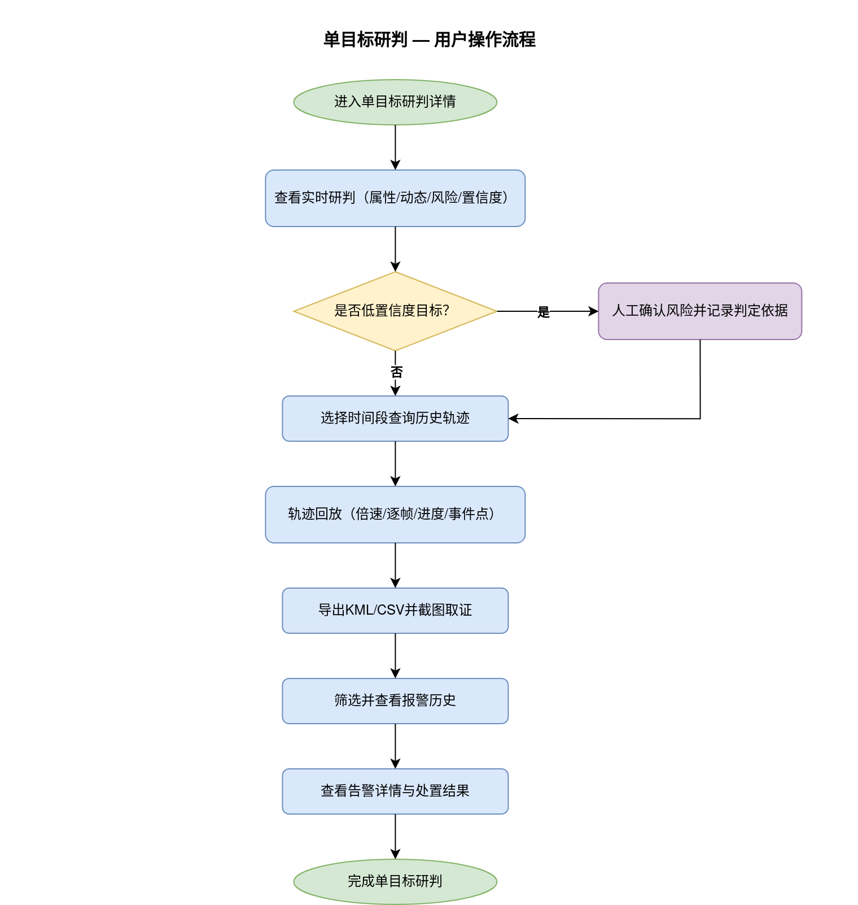
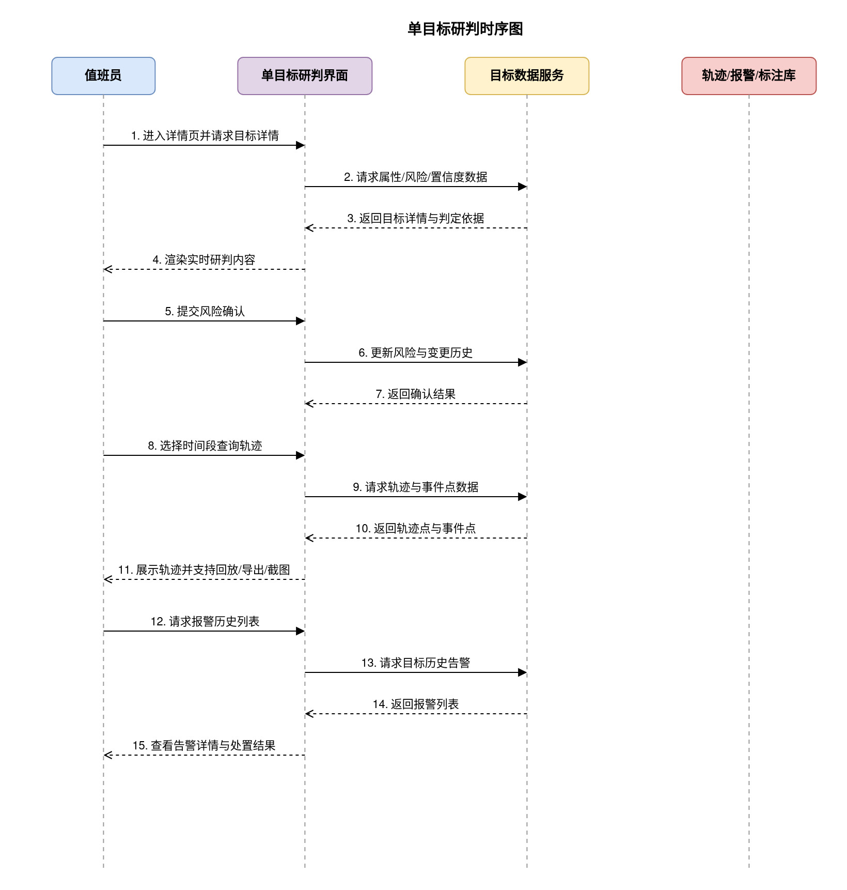
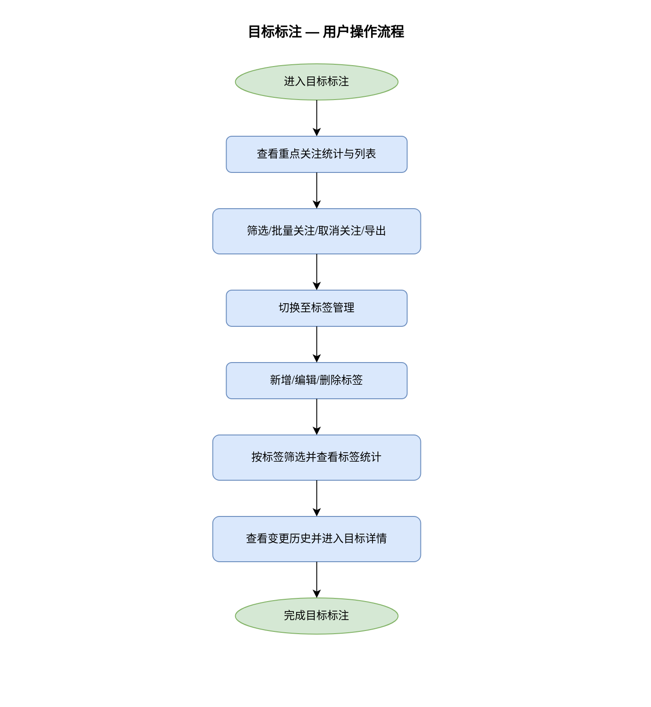
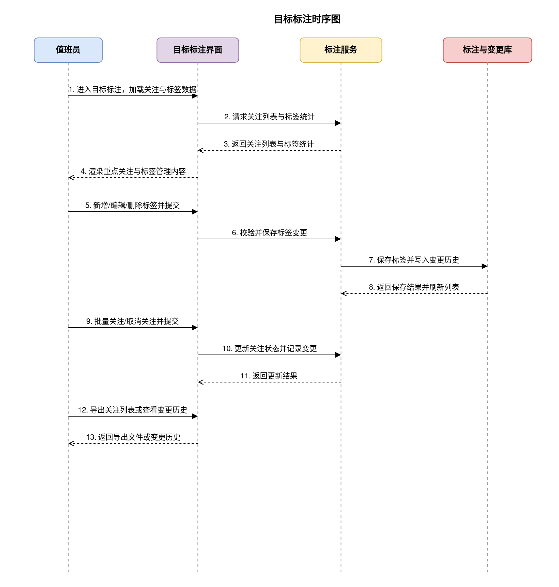

# 一、文档信息

| 项目名称 | 综合态势与多源感知系统-目标管控子系统 |
|---------|---------------------------------|
| 文档版本 | V1.0 |
| 编制日期 | 2026-08-18 |
| 编制人 | - |
| 审核人 | - |
| 批准人 | - |
| 客户单位 | - |
| 编制单位 | - |
| 适用范围 | 目标管控子系统——包含目标总览、单目标研判、目标标注 |
| 核心目标 | 建立融合目标统一查询与人工研判入口，实现目标筛选、单目标深度研判、重点关注与标签标注，支撑人工研判闭环 |
| 文档状态 | 草稿 |

**历史版本**

| 版本 | 日期 | 作者 | 更改说明 |
|-----|------|------|---------|
| V1.0 | 2026-08-18 | - | 初始版本 |

# 二、项目概述

## 2.1 项目背景

随着海上感知数据源不断增多，综合态势与多源感知系统已具备预警事件、设备联动、AI智能研判能力，但目标数据分散在雷达、AIS、光电、电子围栏等多个来源中，人工研判仍面临以下挑战：

1. **目标数据分散**：同一目标在不同数据源中的编号、位置和状态不一致，值班员需要在多个页面之间切换比对，查找目标耗时较长。
2. **目标状态不可解释**：风险等级、融合置信度、三无状态等关键信息缺少统一展示与判定依据，值班员难以快速判断目标可信度。
3. **研判经验难沉淀**：重点关注、标签、备注等人为研判信息分散记录，无法形成可多人共享、可追溯的目标研判档案。
4. **历史行为回溯困难**：目标历史轨迹、风险变更和报警记录缺少集中查询入口，事件复盘与事后取证依赖人工整理。
5. **管控缺乏统一入口**：目标筛选、详情查看、重点关注与标注分散在不同功能中，缺少面向值班员的一站式目标管控入口。

为解决上述问题，建设目标管控子系统，将多源融合目标统一组织为目标总览、单目标研判与目标标注三个能力域，形成从目标查询、深度研判到人工标注的闭环，提升海上目标管控与处置效率。

## 2.2 项目建设目标

本项目旨在建设目标管控子系统，实现以下目标：

1. **建立融合目标统一查询入口**：目标总览集中展示融合目标列表，支持按关键字、目标类型、数据来源、风险等级、时间范围和区域范围组合筛选，支持按时间、距离、速度、风险等级排序，结果可直接导出。
2. **实现单目标深度研判**：单目标研判详情集中展示基础属性、动态信息、五级风险及判定依据、多源融合置信度、历史轨迹和报警历史，支撑对单一目标进行完整研判。
3. **实现历史轨迹回放与取证**：支持任意时间段轨迹查询、多档倍速回放、逐帧控制、事件点标记，以及轨迹导出和截图取证，满足事后复盘需求。
4. **建立重点关注与标签体系**：目标标注模块支持重点关注目标维护、批量关注、自定义标签、标签统计与变更历史，沉淀值班员研判经验并支持多人协作。
5. **形成目标管控与预警联动闭环**：目标详情与报警历史、风险变更历史联动，为预警事件、设备联动和AI研判提供统一目标上下文，后续可扩展关联视频查询。

## 2.3 项目建设范围

本项目建设范围包括：

**系统端**：
- PC端管理后台（Web应用）

**功能模块**：
- 目标总览：目标统计、组合筛选、目标列表、排序、Excel/CSV导出、行内关注与备注、详情跳转
- 单目标研判：实时研判、历史轨迹、报警历史
- 目标标注：重点关注、标签管理、标签统计、变更历史
- Mock数据底座：从585条真实融合目标中精选15条，补齐原型业务字段，支持演示数据重置

**数据范围**：
- 融合目标数据（编号、MMSI、来源编号、经纬度、航向、航速、测量时间、融合类型、三无状态、来源明细）
- 原型补齐数据（船名、呼号、船型、国籍、尺寸、吨位、风险等级、风险判定依据、融合置信度、风险变更历史、历史轨迹、报警历史）
- 人工标注数据（重点关注、标签、备注、风险确认、变更历史）

**不包含的功能**：
- 移动端H5/App（后续迭代实现）
- 真实地图接入（本阶段详情页使用静态示意图表达目标位置与轨迹示意，不接入在线地图服务）
- 关联视频查询（本轮仅保留入口，视频查询能力由后续版本或设备联动子系统提供）
- 目标档案的完整主数据维护（本子系统聚焦查询、研判与标注，不承担船舶档案新增修改）

## 2.4 业务流程图

## 2.5 业务角色定义

| 角色名称 | 角色描述 | 主要职责 | 权限范围 |
|---------|---------|---------|---------|
| 值班员 | 日常值班监控人员 | 查询融合目标、查看单目标研判详情、添加重点关注、补充标签与备注、确认低置信度目标 | 目标查询、详情查看、关注与标注 |
| 指挥员 | 业务决策与管理人员 | 查看全部目标数据、确认高风险目标、审批重点关注与标签体系、导出研判结果 | 全部功能模块，含目标风险确认与导出 |
| 设备操作员 | 现场设备操作人员 | 查看目标实时位置与报警历史，配合现场核验 | 目标详情查看、报警历史查看 |
| 运维管理员 | 系统运维与配置人员 | 维护演示数据、重置演示数据、查看系统运行状态 | 目标数据查看与演示数据维护（不含业务操作） |

## 2.6 术语表

| 术语 | 说明 |
|-----|------|
| 融合目标 | 雷达、AIS、北斗、光电、电子围栏等多源数据经过时空对齐与目标匹配后生成的统一目标记录 |
| 融合置信度 | 多源数据对同一目标身份确认的置信程度，以百分比展示 |
| MMSI | 海上移动通信业务标识（Maritime Mobile Service Identity），船舶唯一身份编码 |
| AIS | 船舶自动识别系统（Automatic Identification System） |
| 三无船只 | 无船名、无船籍、无有效证书的目标，按核查状态分为未确认与已确认 |
| Source ID | 电子围栏等来源对目标使用的来源编号，可与MMSI并存展示 |
| 重点关注 | 值班员主动标记需要持续跟踪的目标集合 |
| 标签 | 值班员自定义的目标分类标识，用于多人协作筛选与统计 |
| KML | 地理信息标记语言，用于轨迹导出的通用格式 |

# 三、项目建设内容

## 3.1 总体功能架构

目标管控子系统作为综合态势与多源感知系统的一级菜单模块，包含以下功能结构：

**PC 端（管理后台）**

- 目标管控（一级菜单）
  - 目标总览（二级菜单）
  - 目标标注（二级菜单）

单目标研判详情作为隐藏页面，不进入菜单，由目标总览列表或目标标注列表点击目标后进入。

### 系统技术架构

目标管控子系统构建于综合态势与多源感知系统的整体技术架构之上，采用"前端原型 + Mock 数据"方式建设。多源感知数据经融合后形成统一目标模型，页面通过数据服务层获取目标列表、详情、轨迹与报警历史，并共享重点关注、标签、备注与风险确认状态；后续接入真实后端时仅替换数据服务层，页面业务规则保持不变。

> 系统架构图如下：

### 功能模块分层

| 层级 | 模块 | 核心职责 |
|------|------|---------|
| 展示交互层 | 目标总览 | 目标统计、组合筛选、列表排序、导出、行内关注与备注 |
| ^ | 单目标研判 | 实时研判、历史轨迹、报警历史 |
| ^ | 目标标注 | 重点关注、标签管理、标签统计、变更历史 |
| 业务服务层 | 目标查询服务 | 目标筛选、排序、分页与统计 |
| ^ | 单目标研判服务 | 目标属性、动态信息、风险等级、融合置信度与人工确认 |
| ^ | 轨迹回放服务 | 时间段查询、倍速回放、逐帧控制、轨迹导出与截图取证 |
| ^ | 标注服务 | 关注、标签、备注、风险确认与变更历史 |
| 数据管理层 | 融合目标库 | 融合目标基础数据、风险等级、置信度与判定依据 |
| ^ | 历史轨迹库 | 轨迹点、事件点与回放数据 |
| ^ | 报警历史库 | 目标历史告警数据 |
| ^ | 标注与变更库 | 重点关注、标签、备注与变更历史 |
| 数据接入层 | 多源感知数据 | 雷达、AIS、北斗、光电、电子围栏融合目标 |
| ^ | 业务上下文 | 预警事件、处置记录、联动记录与AI研判结果 |
| 原型数据层 | 真实快照精选 | 从585条生产融合目标快照中精选15条 |
| ^ | 原型字段补齐 | 船名、船型、风险、轨迹、报警与融合置信度 |
| ^ | 本地持久化 | 关注、标签、备注、风险确认与演示数据重置 |

## 3.2 需求功能清单

| 序号 | 业务需求 | 需求概述 | 优先级 |
|-----|---------|---------|-------|
| 1 | 融合目标统一查询 | 将雷达、AIS、电子围栏等多源融合目标统一组织为目标列表，支持快速定位目标 | P0 |
| 2 | 多条件组合筛选 | 按关键字、目标类型、数据来源、风险等级、时间范围、区域范围组合筛选目标 | P0 |
| 3 | 目标列表多列排序 | 支持按时间、距离、速度、风险等级升降序排序，便于值班员快速判断优先级 | P1 |
| 4 | 筛选结果导出 | 将当前筛选结果导出为Excel/CSV文件，支撑离线分析与上报 | P1 |
| 5 | 单目标实时研判 | 集中展示目标基础属性、动态信息、风险等级与判定依据，支撑单目标深度研判 | P0 |
| 6 | 五级风险可解释 | 风险等级按五级展示，同步展示等级判定依据与风险等级变更历史 | P0 |
| 7 | 低置信度人工确认 | 融合置信度不足的目标进入待人工确认状态，确认结果留痕可追溯 | P0 |
| 8 | 历史轨迹查询回放 | 支持任意时间段轨迹查询，多档倍速回放、逐帧进退与进度条跳转 | P0 |
| 9 | 轨迹导出与取证 | 支持KML/CSV双格式导出与截图取证，支撑事件复盘分析 | P1 |
| 10 | 报警历史查询 | 按目标查看历史告警，支持按告警类型、级别、时间与处置状态筛选 | P1 |
| 11 | 重点关注管理 | 支持添加、取消、批量关注目标，形成重点关注目标集合 | P0 |
| 12 | 自定义标签管理 | 支持新增、编辑、删除标签，并按标签筛选目标与统计数量 | P1 |
| 13 | 人工标注变更追溯 | 关注、标签、备注与风险确认操作记录操作人、时间与变更内容 | P1 |
| 14 | 演示数据管理 | 精选15条真实融合目标作为演示数据，支持一键重置初始状态 | P2 |
| 15 | 多源形态覆盖 | 演示数据覆盖AIS、雷达、电子围栏、雷达+AIS复合等融合类型及三无未确认/已确认形态 | P1 |

## 3.3 页面功能清单

| 终端 | 一级菜单 | 二级菜单 | 子功能 | 功能描述 |
|-----|---------|---------|-------|---------|
| PC端 | 目标管控 | 目标总览 | 目标统计 | 查看目标总数、重点关注、待人工确认、高风险数量 |
| ^ | ^ | ^ | 筛选 | 按关键字、目标类型、数据来源、风险等级、时间范围、区域范围组合筛选 |
| ^ | ^ | ^ | 列表 | 分页展示目标名称、编号、类型、来源、风险、置信度、状态、航速、航向、更新时间、距离 |
| ^ | ^ | ^ | 排序 | 按时间、距离、速度、风险等级切换升降序 |
| ^ | ^ | ^ | 导出 | 将当前筛选结果导出为Excel/CSV |
| ^ | ^ | ^ | 添加关注 | 将目标加入重点关注 |
| ^ | ^ | ^ | 取消关注 | 将目标移出重点关注 |
| ^ | ^ | ^ | 添加备注 | 为目标补充研判备注 |
| ^ | ^ | ^ | 查看详情 | 进入单目标研判详情 |
| ^ | ^ | ^ | 重置筛选 | 恢复默认筛选条件 |
| ^ | ^ | ^ | 重置演示数据 | 一键恢复初始15条目标及关注、标签、备注、风险确认状态 |
| ^ | ^ | 目标标注-重点关注 | 统计概览 | 查看关注总数、高风险关注、今日新增关注 |
| ^ | ^ | ^ | 筛选 | 按风险等级、标签、添加时间筛选关注目标 |
| ^ | ^ | ^ | 关注列表 | 分页展示重点关注目标 |
| ^ | ^ | ^ | 批量关注 | 勾选目标后批量加入重点关注 |
| ^ | ^ | ^ | 取消关注 | 取消单个或批量目标的关注 |
| ^ | ^ | ^ | 查看详情 | 进入单目标研判详情 |
| ^ | ^ | ^ | 导出 | 将关注目标列表导出为Excel/CSV |
| ^ | ^ | 目标标注-标签管理 | 标签列表 | 分页展示自定义标签 |
| ^ | ^ | ^ | 新增标签 | 填写标签名称与颜色配置 |
| ^ | ^ | ^ | 编辑标签 | 修改标签名称与颜色配置 |
| ^ | ^ | ^ | 删除标签 | 删除标签并确认生效 |
| ^ | ^ | ^ | 标签筛选 | 按标签筛选目标 |
| ^ | ^ | ^ | 标签统计 | 查看各标签下的目标数量 |
| ^ | ^ | ^ | 查看变更历史 | 查看关注、标签、备注与风险确认变更记录 |
| ^ | ^ | 单目标研判（隐藏页面） | 查看基础属性 | 查看船名、MMSI、船型、尺寸、国籍与位置示意 |
| ^ | ^ | ^ | 查看动态信息 | 查看实时位置、航向、航速、转向率、更新时间 |
| ^ | ^ | ^ | 查看风险等级 | 查看五级风险及判定依据 |
| ^ | ^ | ^ | 查看风险变更历史 | 查看风险等级变更记录 |
| ^ | ^ | ^ | 查看融合置信度 | 查看融合来源明细与置信度百分比 |
| ^ | ^ | ^ | 风险确认 | 确认低置信度目标风险并记录判定依据 |
| ^ | ^ | ^ | 时间范围查询 | 选择任意时间段查询历史轨迹 |
| ^ | ^ | ^ | 轨迹回放 | 播放或暂停轨迹回放 |
| ^ | ^ | ^ | 倍速切换 | 切换1x/2x/4x/8x/16x倍速 |
| ^ | ^ | ^ | 逐帧控制 | 单帧前进或后退 |
| ^ | ^ | ^ | 进度条跳转 | 拖动进度条定位到任意时间点 |
| ^ | ^ | ^ | 事件点定位 | 点击关键事件点定位并高亮 |
| ^ | ^ | ^ | 导出KML | 将轨迹导出为KML文件 |
| ^ | ^ | ^ | 导出CSV | 将轨迹导出为CSV文件 |
| ^ | ^ | ^ | 截图取证 | 生成带时间水印的模拟取证记录 |
| ^ | ^ | ^ | 报警筛选 | 按告警类型、级别、时间范围、处置状态筛选 |
| ^ | ^ | ^ | 报警列表 | 分页展示目标历史告警 |
| ^ | ^ | ^ | 查看报警详情 | 查看告警详情与处置结果 |

## 3.4 页面访问权限

| 功能模块 | 值班员 | 指挥员 | 设备操作员 | 运维管理员 |
|---------|-------|-------|-----------|-----------|
| 目标总览——统计/筛选/列表/排序/导出/查看详情 | 全部权限 | 全部权限 | 查看 | 查看 |
| 目标总览——添加/取消关注、添加备注 | 全部权限 | 全部权限 | - | - |
| 目标总览——重置演示数据 | - | 全部权限 | - | 全部权限 |
| 单目标研判——实时研判/报警历史查看 | 全部权限 | 全部权限 | 查看 | 查看 |
| 单目标研判——风险确认 | 全部权限 | 全部权限 | - | - |
| 单目标研判——轨迹回放/导出/截图取证 | 全部权限 | 全部权限 | 查看 | - |
| 目标标注——重点关注/标签管理 | 全部权限 | 全部权限 | - | 查看 |
| 目标标注——导出 | 全部权限 | 全部权限 | - | - |

## 3.5 功能详细设计

### 3.5.1 目标总览

**（一）功能需求概述**

目标总览面向值班员提供融合目标统一查询入口，集中展示目标数量、筛选结果、风险状态与重点关注状态，支持按时间、距离、速度、风险等级排序，并将筛选结果导出为Excel/CSV文件，帮助值班员快速定位高风险、待人工确认和重点关注目标。

**（二）功能设计**

**目标统计**

统计区展示目标总数、重点关注数量、待人工确认数量与高风险数量，数量随目标数据变化自动更新。

**查询/筛选功能**

支持以下条件筛选，条件之间为"与"关系，点击查询按钮触发查询：

| 筛选字段 | 类型 | 说明 |
|---------|------|------|
| 关键字 | 文本输入 | 按MMSI、目标编号、Source ID模糊查询，不提供输入联想与搜索历史 |
| 目标类型 | 下拉选择 | 全部/正常船只/三无船只 |
| 数据来源 | 下拉选择 | 全部/雷达/AIS/电子围栏/海兰信/厦漳泉 |
| 风险等级 | 下拉选择 | 全部/低/较低/中/较高/高 |
| 时间范围 | 下拉选择+日期时间范围 | 近1小时/近6小时/近24小时/自定义 |
| 区域范围 | 下拉选择 | 全部/厦门湾/漳州湾/泉州湾 |

**列表功能**

| 列名 | 字段类型 | 说明 |
|-----|---------|------|
| 目标名称 | 文本 | 船名；无船名时展示"三无船只"与显示编号 |
| MMSI/显示编号 | 文本 | 存在MMSI时展示MMSI，无MMSI时展示显示编号并显示"--" |
| 目标类型 | 状态标签 | 正常船只/三无船只（未确认/已确认） |
| 数据来源 | 文本 | 融合类型与来源组合，如雷达、AIS、雷达+AIS |
| 风险等级 | 状态标签 | 低/较低/中/较高/高 |
| 融合置信度 | 百分比 | 0-100%，低于80%时同步标记"待人工确认" |
| 状态 | 状态标签 | 正常/重点关注/待人工确认 |
| 航速 | 数字 | 单位为节 |
| 航向 | 数字 | 0-360度 |
| 更新时间 | 日期时间 | 北京时间 |
| 距离 | 数字 | 系统根据目标当前位置与厦门湾监控中心位置计算，单位为公里 |
| 操作 | 操作按钮 | 关注/取消关注、备注、查看详情（无权限时隐藏） |

分页默认每页10条，支持切换每页数量。列表为空时显示"暂无目标数据"。
列表中目标名称、MMSI/显示编号、目标类型、数据来源、风险等级、融合置信度、航速、航向、更新时间来源于融合目标库；距离由系统按目标位置计算；状态受关注与风险确认记录联动更新。
目标总览以列表方式展示目标，不使用地图作为主要展示方式；列表列顺序固定，不提供列显示配置、列顺序调整与个人布局方案保存。

**排序**

支持按时间、距离、速度、风险等级排序。点击对应列表头切换升序/降序，再次点击反向切换；同一时刻仅按一个字段排序。

**导出**

点击"导出"，选择Excel或CSV格式后将当前筛选结果直接导出。导出成功：自动下载文件，提示"导出成功"。筛选结果为空时导出不可操作，提示"暂无数据可导出"。
导出字段按列表当前展示字段固定输出，不提供导出字段配置。

**添加关注/取消关注**

点击"关注"将目标加入重点关注，目标状态更新为"重点关注"，提示"已加入重点关注"。
点击"取消关注"将目标移出重点关注，目标状态恢复为"正常"，提示"已取消关注"。
关注与取消关注结果同步到目标标注模块，并记录操作人、操作时间与变更内容。

**添加备注**

点击"备注"，弹出编辑窗口填写备注内容后保存。

| 字段名称 | 类型 | 长度限制 | 必填 | 默认值 | 说明 |
|---------|------|---------|------|-------|------|
| 备注内容 | 文本输入 | 1-200字 | 是 | - | 研判备注，保存后记录操作人与操作时间 |

提交成功：提示"备注已保存"。
提交失败：保留填写内容，显示具体错误原因。

**查看详情**

点击"查看详情"或点击目标行，进入该目标的单目标研判详情，按目标编号读取目标详情数据。

**重置筛选**

点击"重置筛选"，恢复默认筛选条件：关键字为空、目标类型为全部、数据来源为全部、风险等级为全部、时间范围为近24小时、区域范围为全部，并刷新列表。

**重置演示数据**

点击"重置演示数据"，弹出确认"确定重置全部演示数据吗？重置后将恢复初始15条目标及关注、标签、备注、风险确认状态。"
确认后恢复初始演示数据，提示"演示数据已重置"。

**业务规则**

- 关键字为空时展示全部目标；关键字输入支持同时匹配MMSI、目标编号与Source ID，不提供输入联想和搜索历史。
- 目标类型选择"三无船只"时，同时包含三无未确认与三无已确认目标；目标类型与数据来源、风险等级等条件按"与"关系叠加。
- 无MMSI目标在列表中展示显示编号，风险判定依据中补充无MMSI说明。
- 融合置信度低于80%的目标状态强制标记为"待人工确认"，确认前不影响列表查询与详情查看。
- 关注/取消关注与备注保存后，目标总览、目标标注与单目标研判共用同一目标状态，变更记录不可修改、不可删除。
- 重置演示数据仅对有权限角色开放；重置后关注、标签、备注与风险确认状态恢复为初始状态。

**边界与异常**

- **空数据**：列表无数据时，显示"暂无目标数据"，并提供"重置筛选"入口。
- **权限不足**：关注、取消关注、备注、重置演示数据按钮对无权限角色完全隐藏。
- **无MMSI**：MMSI列显示"--"，使用显示编号定位目标，目标类型仍按三无状态展示。
- **低置信度**：融合置信度低于80%的目标在状态与置信度列同步标识"待人工确认"。
- **导出失败**：提示"导出失败，请稍后重试"。

**（三）业务逻辑关联**

- 目标列表数据来源于融合目标库，原始融合字段按雷达、AIS、电子围栏等多源感知数据统一组织。
- 关注、取消关注与备注变更同步到目标标注模块，并写入目标变更历史。
- 点击目标进入单目标研判详情，详情页按同一目标编号读取基础属性、轨迹与报警历史。
- 风险等级与置信度数据作为预警事件、设备联动、AI智能研判的目标上下文，其他模块同步引用。

**（四）用户操作流程图**

**（五）功能时序图**

### 3.5.2 单目标研判

**（一）功能需求概述**

单目标研判作为隐藏页面，不进入菜单，由目标总览或目标标注中的目标进入，集中展示单个目标的实时研判信息、历史轨迹与报警历史，支撑值班员完成目标状态确认、风险确认、轨迹回放与事后取证。

**（二）功能设计**

**实时研判**

实时研判集中展示目标基础属性、动态信息、风险等级、风险判定依据、风险变更历史与多源融合置信度。

**基础属性**

| 字段名称 | 类型 | 说明 |
|---------|------|------|
| 船名 | 文本 | 无船名时展示"三无船只" |
| MMSI/显示编号 | 文本 | 存在MMSI时展示MMSI，无MMSI时显示"--"并展示显示编号 |
| 船型 | 文本 | 渔船/货船/客船/快艇等 |
| 尺寸 | 文本 | 长×宽（米） |
| 国籍 | 文本 | 无值显示"-" |
| 呼号 | 文本 | 无值显示"-" |
| 位置示意 | 静态示意图 | 展示目标当前位置示意，原型阶段不接入真实地图，仅示意位置关系 |

**动态信息**

| 字段名称 | 类型 | 说明 |
|---------|------|------|
| 实时位置 | 文本 | 经度,纬度 |
| 航向 | 数字 | 0-360度 |
| 航速 | 数字 | 单位为节 |
| 转向率 | 数字 | 单位为度/分钟 |
| 更新时间 | 日期时间 | 北京时间 |

**风险等级与判定依据**

风险等级按低、较低、中、较高、高五级展示，与列表中的风险等级保持一致。判定依据列表展示当前风险等级对应的风险原因，包括三无状态、无MMSI、接近重点区域、异常行为、低置信度等。

**风险等级 - 视觉与交互规格**

风险等级使用五级颜色梯度标识，由低到高逐级加深，高风险使用醒目警示色；风险等级标识在列表、详情身份信息与风险模块中保持一致。

**风险变更历史**

| 列名 | 字段类型 | 说明 |
|-----|---------|------|
| 变更时间 | 日期时间 | 风险等级变更发生时间 |
| 原风险等级 | 状态标签 | 低/较低/中/较高/高 |
| 新风险等级 | 状态标签 | 低/较低/中/较高/高 |
| 变更原因 | 文本 | 风险等级变化原因 |
| 操作人 | 文本 | 系统自动记录的人工确认或系统变更操作人 |

历史记录按时间倒序展示，记录生成后不可修改、不可删除。

**多源融合置信度**

展示目标融合置信度百分比，并展开参与融合的来源明细，包括雷达、AIS、北斗、光电、电子围栏等来源的参与状态与匹配结果。融合置信度低于80%时，目标标记为"待人工确认"。

**风险确认**

融合置信度低于80%的目标进入待人工确认状态，可执行风险确认。

| 字段名称 | 类型 | 长度限制 | 必填 | 默认值 | 说明 |
|---------|------|---------|------|-------|------|
| 风险等级 | 下拉选择 | - | 是 | 当前风险等级 | 低/较低/中/较高/高 |
| 确认依据 | 文本输入 | 1-200字 | 是 | - | 人工确认结论与依据 |

提交成功：提示"风险已确认"，目标状态恢复为"已确认"，确认记录写入风险变更历史。
提交失败：保留填写内容，显示具体错误原因。

**历史轨迹**

**时间范围查询**

支持按任意时间段查询目标历史轨迹，默认展示近24小时轨迹。

| 筛选字段 | 类型 | 说明 |
|---------|------|------|
| 开始时间 | 日期时间 | 轨迹查询起始时间，必填 |
| 结束时间 | 日期时间 | 轨迹查询结束时间，必填，不早于开始时间 |

点击查询后展示查询时间范围内的轨迹数据。开始时间晚于结束时间时阻止查询，提示"开始时间不能晚于结束时间"。

**轨迹展示与回放**

以静态示意图展示目标历史轨迹，包含轨迹路线与关键事件点，原型阶段不接入真实地图，仅示意轨迹走向与事件位置。
支持播放/暂停、1x/2x/4x/8x/16x倍速切换、单帧前进/后退与进度条拖动。播放时轨迹当前点随时间推进更新，暂停后可逐帧查看。

**事件点标记**

轨迹中的告警等关键事件自动生成事件点标记。点击事件点后，轨迹定位到该事件发生位置，并展示事件时间、事件类型与事件描述。

**轨迹导出**

点击"导出KML"或"导出CSV"，将当前查询时间范围内的轨迹导出为对应格式文件。导出成功：自动下载文件，提示"轨迹已导出"。无轨迹数据时导出不可操作，提示"暂无轨迹数据可导出"。

**截图取证**

点击"截图取证"，生成带时间水印的模拟取证记录，记录包含目标编号、当前轨迹画面与生成时间，生成后可在页面查看并下载。生成成功：提示"取证记录已生成"。

**报警历史**

展示当前目标的历史告警记录，支持按告警类型、告警级别、时间范围与处置状态筛选。

| 筛选字段 | 类型 | 说明 |
|---------|------|------|
| 告警类型 | 下拉选择 | 全部/越界报警/三无船只/异常行为/其他 |
| 告警级别 | 下拉选择 | 全部/提示/一般/重要/紧急 |
| 时间范围 | 日期时间范围 | 按告警触发时间筛选 |
| 处置状态 | 下拉选择 | 全部/待处置/处置中/已处置/已归档 |

| 列名 | 字段类型 | 说明 |
|-----|---------|------|
| 告警编号 | 文本 | 系统自动生成的告警编号 |
| 告警类型 | 文本 | 越界报警/三无船只/异常行为/其他 |
| 告警级别 | 状态标签 | 提示/一般/重要/紧急 |
| 触发时间 | 日期时间 | 告警触发时间 |
| 处置状态 | 状态标签 | 待处置/处置中/已处置/已归档 |
| 处置结果 | 文本 | 无处置结果时显示"-" |
| 操作 | 操作按钮 | 查看详情 |

分页默认每页10条，支持切换每页数量。列表为空时显示"暂无报警数据"。
列表字段来源于该目标的报警历史记录，处置状态随事件处置进展同步更新。

**查看报警详情**

| 字段名称 | 类型 | 说明 |
|---------|------|------|
| 告警编号 | 文本 | 系统自动生成的告警编号 |
| 目标 | 文本 | 目标名称与显示编号 |
| 告警类型 | 文本 | 越界报警/三无船只/异常行为/其他 |
| 告警级别 | 状态标签 | 提示/一般/重要/紧急 |
| 触发时间 | 日期时间 | - |
| 告警描述 | 文本 | 告警内容与触发说明 |
| 证据信息 | 文本 | 轨迹、位置等佐证信息 |
| 处置状态 | 状态标签 | 待处置/处置中/已处置/已归档 |
| 处置结果 | 文本 | 处置结论与补充说明 |
| 处置人 | 文本 | 处置操作人 |
| 处置时间 | 日期时间 | 最近一次处置时间 |

关联视频查询本轮不包含，后续版本补充。

**业务规则**

- 风险等级变更历史记录生成后不可修改、不可删除，按时间倒序展示。
- 融合置信度低于80%的目标必须完成风险确认后才恢复为"已确认"状态，确认后写入风险变更历史。
- 历史轨迹查询结果受开始时间与结束时间限制，播放进度只作用于当前查询结果，切换查询条件后重新加载轨迹。
- 无轨迹数据时播放、逐帧、倍速与导出均不可操作；静止目标提示"目标未移动"。
- 轨迹事件点来源于轨迹数据中的关键事件标记，与报警历史共用同一目标与时间信息。
- 报警历史仅展示当前目标的数据，处置状态随预警事件处置进展同步更新。

**边界与异常**

- **空数据**：轨迹无数据时显示"暂无轨迹数据"；报警无数据时显示"暂无报警数据"。
- **权限不足**：风险确认、轨迹导出、截图取证按钮对无权限角色完全隐藏。
- **静止目标**：轨迹退化为单点，提示"目标未移动"，播放控件不可操作。
- **无轨迹数据**：轨迹导出与播放不可操作，提示"暂无轨迹数据可导出"。
- **无报警数据**：报警历史展示空状态，不展示空列表。
- **截图失败**：提示"取证记录生成失败，请稍后重试"。

**（三）业务逻辑关联**

- 目标基础属性、动态信息、风险等级与融合置信度来源于融合目标库，与目标总览共用同一目标状态。
- 风险确认结果写入目标风险变更历史，并同步更新目标总览中的风险等级与状态。
- 历史轨迹与报警历史来源于目标轨迹库与报警历史库，事件点数据与预警事件、设备联动、AI智能研判的告警记录关联。
- 截图取证记录保存在目标研判记录中，供事件复盘与处置证据使用。

**（四）用户操作流程图**

**（五）功能时序图**

### 3.5.3 目标标注

目标标注用于沉淀值班员对目标的持续跟踪判断，提供重点关注与标签管理两个分区。重点关注集中管理需持续跟踪的目标集合，标签管理维护自定义标签体系并记录关注、标签、备注与风险确认变更历史，支撑多人协作补充研判信息。

#### 3.5.3.1 重点关注

**（一）功能需求概述**

重点关注面向值班员集中维护需持续跟踪的目标集合，支持按风险等级、标签与添加时间筛选，支持批量关注、批量取消关注与列表导出，为目标总览和单目标研判提供一致的关注状态。

**（二）功能设计**

**统计概览**

统计区展示关注总数、高风险关注数量与今日新增关注数量，数量随关注变更自动更新。

**查询/筛选功能**

支持以下条件筛选，条件之间为"与"关系，点击查询按钮触发查询：

| 筛选字段 | 类型 | 说明 |
|---------|------|------|
| 风险等级 | 下拉选择 | 全部/低/较低/中/较高/高 |
| 标签 | 下拉选择 | 全部/已创建的标签 |
| 添加时间 | 日期时间范围 | 按加入重点关注时间筛选 |

**关注列表**

| 列名 | 字段类型 | 说明 |
|-----|---------|------|
| 目标名称 | 文本 | 船名；无船名时展示"三无船只"与显示编号 |
| MMSI/显示编号 | 文本 | 存在MMSI时展示MMSI，无MMSI时展示显示编号 |
| 目标类型 | 状态标签 | 正常船只/三无船只（未确认/已确认） |
| 数据来源 | 文本 | 融合类型与来源组合 |
| 风险等级 | 状态标签 | 低/较低/中/较高/高 |
| 标签 | 文本 | 已添加的标签，多个标签逐个展示 |
| 关注时间 | 日期时间 | 加入重点关注的时间 |
| 操作 | 操作按钮 | 查看详情/取消关注 |

分页默认每页10条，支持切换每页数量。列表为空时显示"暂无重点关注目标"。
列表字段来源于融合目标库与关注记录，关注时间来源于人工关注操作。

**批量关注**

点击"批量关注"，打开可关注目标选择列表，列表字段与目标总览一致，勾选目标后批量加入重点关注，提示"已加入重点关注"。已关注目标不可重复勾选。

**批量取消关注**

勾选关注列表中的目标后，点击"取消关注"，弹出确认"确定取消选中目标的关注吗？"确认后批量移出重点关注，提示"已取消关注"。

**取消关注**

点击行内"取消关注"，弹出确认"确定取消对【目标名称】的关注吗？"确认后目标移出重点关注，提示"已取消关注"。

**查看详情**

点击"查看详情"或点击目标行，进入该目标的单目标研判详情。

**导出**

点击"导出"，选择Excel或CSV格式后将当前关注列表导出。导出成功：自动下载文件，提示"导出成功"。列表为空时导出不可操作，提示"暂无数据可导出"。

**业务规则**

- 同一目标不可重复加入重点关注，重复操作时提示"该目标已在重点关注中"。
- 关注、取消关注变更同步到目标总览的目标状态，并写入目标变更历史。
- 关注总数、高风险关注数量与今日新增关注数量随关注变更实时更新。
- 标签筛选范围为标签管理中已创建的标签，删除标签后筛选选项中同步移除。

**边界与异常**

- **空数据**：关注列表无数据时，显示"暂无重点关注目标"。
- **权限不足**：批量关注、取消关注、导出按钮对无权限角色完全隐藏。
- **导出失败**：提示"导出失败，请稍后重试"。
- **筛选无结果**：提示"暂无重点关注目标"，并提供重置筛选入口。

**（三）业务逻辑关联**

- 重点关注状态来源于人工关注记录，目标总览与单目标研判同步展示同一关注状态。
- 关注变更写入目标变更历史，标签管理中的变更历史同步展示关注记录。
- 点击目标进入单目标研判详情，按同一目标编号读取研判数据。

#### 3.5.3.2 标签管理

**（一）功能需求概述**

标签管理面向值班员维护自定义目标标签，支持标签新增、编辑、删除、按标签筛选目标、查看标签统计与变更历史，用于多人协作对目标进行分类标记和快速筛选。

**（二）功能设计**

**标签列表**

| 列名 | 字段类型 | 说明 |
|-----|---------|------|
| 标签名称 | 文本 | 自定义标签名称 |
| 标签颜色 | 颜色标识 | 预置颜色选项，用于区分不同标签 |
| 目标数 | 数字 | 当前标签下关联的目标数量 |
| 创建时间 | 日期时间 | 标签创建时间 |
| 操作 | 操作按钮 | 编辑/删除 |

分页默认每页10条，支持切换每页数量。列表为空时显示"暂无标签数据"。
标签名称、标签颜色、创建时间来源于标签记录，目标数由系统统计当前标签关联目标数量。

**新增标签**

点击"新增标签"，弹出编辑窗口填写标签信息。

| 字段名称 | 类型 | 长度限制 | 必填 | 默认值 | 说明 |
|---------|------|---------|------|-------|------|
| 标签名称 | 文本输入 | 1-20字 | 是 | - | 系统内唯一 |
| 标签颜色 | 单选 | - | 是 | 第一个预置颜色 | 预置颜色选项中选择一个 |

提交成功：提示"标签已新增"，标签列表与标签筛选选项同步更新。
提交失败：保留填写内容，显示具体错误原因。

**编辑标签**

点击"编辑"，自动填入当前标签数据，表单字段同新增。
提交成功：提示"标签已更新"。

**删除标签**

点击"删除"，弹出确认"确定删除标签【标签名称】吗？删除后相关目标将移除该标签。"
确认后删除标签，相关目标自动解除该标签，提示"标签已删除"。

**标签筛选**

在标签列表中选择标签后，查看该标签下的目标列表，目标列表字段与重点关注列表一致，点击目标可进入单目标研判详情。

**标签统计**

标签列表同步展示每个标签关联的目标数量，目标新增或移除标签后数量自动更新。

**变更历史**

展示关注、标签、备注与风险确认的变更记录。

| 列名 | 字段类型 | 说明 |
|-----|---------|------|
| 变更时间 | 日期时间 | 操作发生时间 |
| 操作人 | 文本 | 操作人员 |
| 变更类型 | 文本 | 关注/标签/备注/风险确认 |
| 目标 | 文本 | 目标名称与显示编号 |
| 变更内容 | 文本 | 变更前后内容或操作说明 |

变更历史按时间倒序展示，记录生成后不可修改、不可删除。

**业务规则**

- 标签名称在系统内全局唯一。新增/编辑时若重复，阻止提交，提示"标签名称【标签名称】已存在，请更换"。
- 编辑标签名称或颜色后，所有关联目标同步更新，并记录标签变更历史。
- 删除标签时无需先解除关联，确认后相关目标自动移除该标签，标签统计同步更新。
- 变更历史中的关注、标签、备注与风险确认记录不可修改、不可删除。

**边界与异常**

- **空数据**：标签列表无数据时，显示"暂无标签数据"。
- **权限不足**：新增、编辑、删除标签按钮对无权限角色完全隐藏。
- **标签重名**：新增或编辑时标签名称重复，阻止提交，提示"标签名称【标签名称】已存在，请更换"。
- **删除确认取消**：取消删除后标签及相关目标关联保持不变。

**（三）业务逻辑关联**

- 标签数据来源于标签管理，目标总览、重点关注与单目标研判中的标签筛选共用同一标签集合。
- 标签新增、编辑、删除后，重点关注列表的标签筛选与标签统计同步更新。
- 标签与目标关联变更写入变更历史，作为人工研判留痕记录。

**（四）用户操作流程图**

**（五）功能时序图**

# 四、技术方案

## 4.1 技术架构

本阶段采用"前端原型 + Mock数据"建设方式，整体沿用综合态势与多源感知系统的技术架构：

- 前端：组件化单页应用，按目标总览、单目标研判、目标标注三个功能域组织页面，复用统一菜单、权限与目标状态展示能力
- Mock数据层：从585条真实融合目标快照中精选15条，补齐船名、船型、风险等级、融合置信度、历史轨迹与报警历史等业务字段，输出格式与真实融合目标字段契约对齐
- 数据存储：融合目标库、历史轨迹库、报警历史库与标注变更库，关注、标签、备注与风险确认状态在浏览器本地保存，演示数据独立初始化
- 部署：与综合态势与多源感知系统同环境部署，演示数据随系统启动自动初始化，后续接入真实后端时仅替换数据服务层

## 4.2 数据交互

- 页面与目标数据服务层之间通过统一数据通道交互，交互内容包括目标列表、目标详情、历史轨迹、报警历史、关注、标签、备注与风险确认结果
- 数据格式采用结构化定义，字段命名与正式融合目标契约一致，后续接入真实后端时页面无需变更
- 目标总览、单目标研判与目标标注共用同一目标状态，关注、标签、备注与风险确认变更后同步更新并写入变更历史
- 单目标研判详情按目标编号读取基础属性、轨迹与报警历史，轨迹回放、截图取证与报警详情基于同一目标上下文
- 演示数据与真实业务数据隔离存储，重置演示数据仅影响目标管控子系统的演示状态

## 4.3 安全方案

- 身份认证：复用系统统一账号体系，登录后进入目标管控子系统
- 权限控制：按角色控制页面与按钮访问，无权限按钮完全隐藏
- 数据安全：关注、标签、备注、风险确认与导出操作完整留痕，可按时间与操作人追溯
- 演示数据隔离：Mock数据独立存储，不污染真实业务数据；演示数据重置不影响其他子系统

# 五、非功能需求

## 5.1 性能需求

- 页面加载时间小于3秒，目标列表查询响应时间小于1秒
- 历史轨迹查询响应时间小于2秒，轨迹倍速与逐帧切换响应时间小于0.5秒
- 目标详情、报警历史切换响应时间小于2秒
- 支持不少于100个并发用户

## 5.2 安全需求

- 基于角色的访问控制，越权操作不可发起
- 关注、标签、备注、风险确认与导出等关键操作记录操作人与操作时间
- 目标数据仅在授权范围内展示，导出操作需通过权限校验

## 5.3 可用性需求

- 系统可用性不低于99.5%
- 历史轨迹或报警数据为空时页面可正常访问，并展示对应空状态提示
- 演示数据重置后系统可立即恢复初始状态，无需重启
- 原型阶段不依赖在线地图服务，位置与轨迹通过静态示意图展示

## 5.4 兼容性需求

- 浏览器：Chrome、Firefox、Safari、Edge最新版本
- 分辨率：1920×1080、1536×864、1366×768
- 列表筛选、轨迹回放与导出操作支持鼠标操作，兼容常用显示器分辨率

# 六、数据需求

## 6.1 数据字典

| 枚举类型 | 枚举值 | 说明 |
|---------|-------|------|
| 目标类型 | 正常船只 | 具备完整身份信息的目标 |
| ^ | 三无船只 | 无船名、无船籍、无有效证书的目标 |
| 三无状态 | 未确认 | 尚未核实三无身份 |
| ^ | 已确认 | 已核实三无身份 |
| 数据来源 | 雷达 | 雷达感知数据 |
| ^ | AIS | 船舶自动识别系统数据 |
| ^ | 电子围栏 | 电子围栏感知数据 |
| ^ | 海兰信 | 海兰信数据来源 |
| ^ | 厦漳泉 | 厦漳泉数据来源 |
| 融合类型 | AIS | 单一AIS融合目标 |
| ^ | 雷达 | 单一雷达融合目标 |
| ^ | 电子围栏 | 单一电子围栏融合目标 |
| ^ | 雷达+AIS | 雷达与AIS复合融合目标 |
| 风险等级 | 低 | 风险等级1，最低风险 |
| ^ | 较低 | 风险等级2 |
| ^ | 中 | 风险等级3 |
| ^ | 较高 | 风险等级4 |
| ^ | 高 | 风险等级5，最高风险 |
| 目标状态 | 正常 | 无特殊关注状态 |
| ^ | 重点关注 | 已加入重点关注 |
| ^ | 待人工确认 | 融合置信度低于80%或三无未确认，等待人工确认 |
| 确认状态 | 已确认 | 已完成风险确认 |
| ^ | 待人工确认 | 等待人工确认 |
| 告警级别 | 提示 | 最低级别告警 |
| ^ | 一般 | 一般级别告警 |
| ^ | 重要 | 重要级别告警 |
| ^ | 紧急 | 紧急级别告警 |
| 处置状态 | 待处置 | 告警等待处置 |
| ^ | 处置中 | 告警处置进行中 |
| ^ | 已处置 | 告警已完成处置 |
| ^ | 已归档 | 告警记录已归档 |
| 告警类型 | 越界报警 | 目标越出预警区域 |
| ^ | 三无船只 | 三无目标触发告警 |
| ^ | 异常行为 | 异常行为触发告警 |
| ^ | 其他 | 其他类型告警 |

## 6.2 数据存储要求

- 融合目标库：保存15条精选演示目标，包含Kafka融合目标字段与原型补齐字段
- 历史轨迹库：保存目标24小时轨迹数据，包含轨迹点、事件点与回放数据
- 报警历史库：保存目标历史告警记录，包含告警级别、处置状态与处置结果
- 标注变更库：保存关注、标签、备注与风险确认的变更历史，支持按时间与操作人追溯
- 关注、标签、备注与风险确认状态在浏览器本地保存，重置演示数据后恢复初始状态
- 演示数据与真实业务数据隔离存储，重置操作不影响其他子系统

# 七、接口需求

本阶段采用"前端原型 + Mock数据"，页面所需数据均由模拟数据通道提供，正式数据服务接入后按统一数据规范对接。

## 7.1 模拟数据通道

| 数据服务 | 用途 |
|---------|------|
| 目标列表查询 | 目标总览筛选、排序、分页与统计 |
| 目标详情查询 | 单目标研判基础属性、动态信息、风险等级与融合置信度 |
| 历史轨迹查询 | 任意时间段轨迹、事件点与回放数据 |
| 报警历史查询 | 目标历史告警筛选与详情 |
| 重点关注维护 | 单个或批量关注、取消关注 |
| 备注维护 | 目标备注保存与历史记录 |
| 标签维护 | 标签新增、编辑、删除与目标标签更新 |
| 风险确认 | 低置信度目标风险等级确认 |
| 标签统计 | 各标签目标数量统计 |
| 演示数据重置 | 恢复初始15条目标及关注、标签、备注、风险确认状态 |

模拟数据格式、字段命名与正式融合目标契约一致，后续替换真实数据服务时页面无需变更。

## 7.2 系统协同

- 与预警事件管理：目标风险等级、报警历史与风险变更历史作为事件处置的目标上下文，事件处置状态同步至目标报警历史
- 与设备联动子系统：目标详情提供联动视频入口，本轮不实现视频查询，后续版本复用设备联动能力
- 与AI智能研判：目标基础属性、风险等级与融合置信度作为AI研判输入，AI研判结论与告警记录回流至目标报警历史

# 八、项目实施与验收

## 8.1 实施阶段

1. **需求确认阶段**（1周）：需求评审、原型确认、需求基线锁定
2. **设计开发阶段**（3周）：详细设计、前端原型开发、Mock数据开发
3. **测试部署阶段**（1周）：功能测试、性能测试、用户验收测试、部署上线
4. **上线运行阶段**（1周）：试运行、问题修复、正式上线

## 8.2 系统培训服务

- **培训对象**：值班员、指挥员、设备操作员、运维管理员
- **培训内容**：目标总览筛选与导出、单目标研判、轨迹回放与取证、重点关注与标签管理
- **培训方式**：现场培训、在线培训、操作手册

## 8.3 验收标准

- **功能验收**：目标总览、单目标研判、目标标注功能按SRS实现，3.2需求功能清单无缺失，无P0/P1级缺陷
- **性能验收**：满足第五章非功能需求指标
- **数据验收**：15条演示数据形态覆盖完整，演示数据可重置，关键操作留痕完整
- **文档验收**：提供设计方案、操作手册与验收报告

# 九、附录

## 附录A：术语表

| 术语 | 说明 |
|-----|------|
| 融合目标 | 多源感知数据经时空对齐与目标匹配后生成的统一目标记录 |
| 融合置信度 | 多源数据对同一目标身份确认的置信程度，以百分比展示 |
| MMSI | 海上移动通信业务标识（Maritime Mobile Service Identity），船舶唯一身份编码 |
| AIS | 船舶自动识别系统（Automatic Identification System） |
| 三无船只 | 无船名、无船籍、无有效证书的目标 |
| Source ID | 电子围栏等来源对目标使用的来源编号 |
| 重点关注 | 值班员主动标记需要持续跟踪的目标集合 |
| 标签 | 值班员自定义的目标分类标识 |
| KML | 地理信息标记语言，用于轨迹导出的通用格式 |
| SRS | 软件需求规格说明书（Software Requirements Specification） |

## 附录B：参考资料

- 《综合态势与多源感知功能清单》
- 《船的数据备注》
- 《船的数据》
- 《综合态势与多源感知-目标管控子系统设计方案》V1.0
- 《综合态势与多源感知系统-SRS需求规格说明书》V1.0
- 《综合态势与多源感知系统-AI智能研判子系统-SRS需求规格说明书》V1.0
